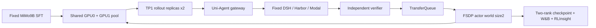

# MiMo 双卡 colocate_async 实测

## 用户目标与批准范围

用户明确“测试colocate_async”并纠正A5为错字，要求尽快双卡正常运行、复用此前经验。此设计落实已授权模式与双卡测试；原C4及全部证据保留，不做未经验证的rank1→rank2恢复。

目标：固定MiMo9B初始模型、真实Code001661、DSH/Harbor/Modal、native VERL GRPO，在两张RTX PRO6000上共享采样/训练池，完成两步有界功能测试。它是fresh拓扑验证，不声称从C4续训或严格复现r12性能。

## 架构

每张卡在采样与训练阶段间切换，不承诺同卡同时执行二者。采样源仍受会话/环境等待限制；为实际给两个TP1副本供给请求，max_concurrent_sessions和max_num_seqs设为2，工具max_parallel_calls保持1。n4保持，足够分到2个actor ranks；此为拓扑加并发功能测试，不是单变量速度对照。只有实际GPU UUID/PID、请求路由及两rank训练证据才能证明双卡利用。

## 最小文件范围

- examples/mimo_dsh_rl/mimo-9b-dual-colocate-observed.yaml：colocate_async、trainer2GPU、rollout无独立池、TP1、naive、2步；保留n4/32K/20480预算和native监控。
- docs/本worktree/mimo_r14_preparation.py、mimo_r14_preflight.py：独立运行身份、fresh模式显式校验、两卡资源合同、冻结源码及原期限、真实IPC准入。
- tests/uni_agent/下对应recipe/preparation测试：错误rank恢复拒绝、拓扑/预算/日志合同。
- docs/本worktree/evidence/r14*：预检、运行和真实验收；tasks同名目录记录交接。

## API与运行合同

复用launch/controller/registration/receipt/budget-terminal-v1合同，不改VERL内核、DSH版本、Harbor工具协议或共享uv依赖。不得给fresh run传resume-from-path，不得将旧checkpoint重命名冒充worldsize2。新run/spec/controller/W&B/Ray身份及目录隔离，private Hydra输出，源码只读。现有C3/C4保持完整。

固定截止2026-09-29 19:16:41UTC，最后180秒预留清理；GPU Pod不关闭/删除。Mac只做代码/Git/Ruff/SSH，云端执行tests、依赖与GPU检查。已存在其他用户脏文件不入提交。

## 验证与停止标准

1. 云端CPU完整compose、fresh/rank/预算/source/checkpoint拒绝门禁；完整ruff双门禁后提交推送并freeze。
2. 复用并核验已有naive IPC证据及相同源码；执行必要的双GPU通路短探针，不能拿NCCL探针冒充naive。核两GPU无他人进程。
3. 真实启动：两rank建立、两个TP1 replica实际映射；native初始化/采样/更新分别记录时间。若拓扑失败，保存精确异常后修复，不将闲置GPU说成成功。
4. n4真实receipt与消费组对应；实际step、finite loss/gradient、reward分布、两个rank checkpoint完整。若reward相同或grad0，报告学习信号不足，不能用参数惯性更新替代。
5. W&B完整history对console，RLInsight真实project/experiment指标及trace；退出状态、所属进程/Modal回收，保留Pod与模型。

## 历史复用依据

memory/pipeline-pass-2026-09-16.md：旧terminus2链路colocate训练及resume通过；不等于MiMo双rank已经验证。
memory/harbor-rl-runs-2026-09-17.md：部分双卡记录是student+teacher，不能混同actor worldsize2。
本worktree r9：MiMo单卡colocate成功；r10/r12：双卡separate成功。复用原DSH、镜像、模型、数据、verifier、预算、entropy分块修复、uv273约束及监控，不重造整条链路。

## 真实准入纠偏

r13在GPU主机CPU-only预检时因最终session并发仍为1而拒绝，没有启动controller或训练。原r12 operator模板显式调用prepare_training(max_concurrent_sessions=1)，生成launch.environment.MAX_CONCURRENT_SESSIONS后按设计覆盖recipe。r14仅将这一个调用参数改2，并在prepare输出后断言最终绑定值；补真实prepare→launch compose回归。r13冻结源/失败/旧checkpoint保留，新r14使用独立身份与38700–38703端口。
# Controller dependency admission (R15 repair)

R14 exposed a missing `cloudflared` executable on the controller's PATH. The approved minimal repair validates executable discovery in `harbor_run_controller.main` after RunSpec parsing and before constructing the controller or any listener/tunnel. SSH is always required; cloudflared is required only with Modal ingress. Missing dependencies raise a clear error naming the executable, without starting resources. The operator separately supplies the existing private binary directory on PATH. Regression tests exercise the real async main entry with missing/present dependencies and non-Modal specs, proving construction is never reached on a missing dependency. No training recipe, shared environment, or dependency installation changes are involved.

## World-size-two 有效更新验收（独立 operator，R15起）

新增 `docs/verl-uni-agent-harbor-opd-rl/mimo_world2_acceptance.py` 与对应CPU测试；不修改冻结训练源码及原single-rank checker。接口接受 expected run/spec、绝对step（默认R15/step2）、真实launch、batch audit、原console log、原生sharded delta报告与两个checker源码路径。检查点从已绑定launch的run root推导为C(step-1)→C(step)，因此后续C2→C3无需复制schema。

新schema `mimo.world2-effective-update.v1`：先重新绑定batch/receipt审计与4个消费TQ keys；同step唯一console metrics须有reward方差、正负advantage、finite非零grad。双rank报告须绑定已审核checker源码SHA、world2 config、rank0/1全部model/optim/extra原始文件路径与SHA；重新验证全局分片边界/无重叠/完整覆盖、所有finite、base不变而LoRA变化、各rank optimizer绝对步数前后相邻且非零moments变化。不得改schema伪装single-rank或仅依赖passed字段。

测试覆盖真实临时证据文件的正常组合及假SHA、缺rank、错run/step/key、恒定奖励、零梯度、base改变、optimizer全零、分片缺失/重叠、伪造summary、重复metrics等拒绝路径。全部测试在云端CPU执行；C2生成后才读取真实checkpoint。验收输出明确fresh训练未做独立resume验证、未证明exact异步重放、未证明能力提升；W&B/RLInsight与GPU实际映射分别保留独立证据，不替代有效更新门禁。
