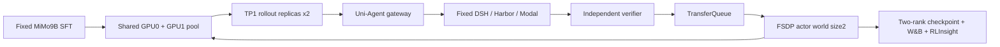

# MiMo 双卡 colocate_async 实测

## 用户目标与批准范围

用户明确“测试colocate_async”并纠正A5为错字，要求尽快双卡正常运行、复用此前经验。此设计落实已授权模式与双卡测试；原C4及全部证据保留，不做未经验证的rank1→rank2恢复。

目标：固定MiMo9B初始模型、真实Code001661、DSH/Harbor/Modal、native VERL GRPO，在两张RTX PRO6000上共享采样/训练池，完成三步有界功能测试（当前 R17）。它是fresh拓扑验证，不声称从C4续训或严格复现r12性能。

## 架构

每张卡在采样与训练阶段间切换，不承诺同卡同时执行二者。采样源仍受会话/环境等待限制；为实际给两个TP1副本供给请求，max_concurrent_sessions和max_num_seqs设为2，工具max_parallel_calls保持1。n4保持，足够分到2个actor ranks；此为拓扑加并发功能测试，不是单变量速度对照。只有实际GPU UUID/PID、请求路由及两rank训练证据才能证明双卡利用。

## 最小文件范围

- examples/mimo_dsh_rl/mimo-9b-dual-colocate-observed.yaml：colocate_async、trainer2GPU、rollout无独立池、TP1、naive、2步；保留n4/32K/20480预算和native监控。
- docs/本worktree/mimo_r14_preparation.py、mimo_r14_preflight.py：独立运行身份、fresh模式显式校验、两卡资源合同、冻结源码及原期限、真实IPC准入。
- tests/uni_agent/下对应recipe/preparation测试：错误rank恢复拒绝、拓扑/预算/日志合同。
- docs/本worktree/evidence/r14*：预检、运行和真实验收；tasks同名目录记录交接。

## API与运行合同

复用launch/controller/registration/receipt/budget-terminal-v1合同，不改VERL内核、DSH版本、Harbor工具协议或共享uv依赖。不得给fresh run传resume-from-path，不得将旧checkpoint重命名冒充worldsize2。新run/spec/controller/W&B/Ray身份及目录隔离，private Hydra输出，源码只读。现有C3/C4保持完整。

固定截止2026-09-29 19:16:41UTC，最后180秒预留清理；GPU Pod不关闭/删除。Mac只做代码/Git/Ruff/SSH，云端执行tests、依赖与GPU检查。已存在其他用户脏文件不入提交。

## 验证与停止标准

1. 云端CPU完整compose、fresh/rank/预算/source/checkpoint拒绝门禁；完整ruff双门禁后提交推送并freeze。
2. 复用并核验已有naive IPC证据及相同源码；执行必要的双GPU通路短探针，不能拿NCCL探针冒充naive。核两GPU无他人进程。
3. 真实启动：两rank建立、两个TP1 replica实际映射；native初始化/采样/更新分别记录时间。若拓扑失败，保存精确异常后修复，不将闲置GPU说成成功。
4. n4真实receipt与消费组对应；实际step、finite loss/gradient、reward分布、两个rank checkpoint完整。若reward相同或grad0，报告学习信号不足，不能用参数惯性更新替代。
5. W&B完整history对console，RLInsight真实project/experiment指标及trace；退出状态、所属进程/Modal回收，保留Pod与模型。

## 历史复用依据

memory/pipeline-pass-2026-09-16.md：旧terminus2链路colocate训练及resume通过；不等于MiMo双rank已经验证。
memory/harbor-rl-runs-2026-09-17.md：部分双卡记录是student+teacher，不能混同actor worldsize2。
本worktree r9：MiMo单卡colocate成功；r10/r12：双卡separate成功。复用原DSH、镜像、模型、数据、verifier、预算、entropy分块修复、uv273约束及监控，不重造整条链路。

## 真实准入纠偏

r13在GPU主机CPU-only预检时因最终session并发仍为1而拒绝，没有启动controller或训练。原r12 operator模板显式调用prepare_training(max_concurrent_sessions=1)，生成launch.environment.MAX_CONCURRENT_SESSIONS后按设计覆盖recipe。r14仅将这一个调用参数改2，并在prepare输出后断言最终绑定值；补真实prepare→launch compose回归。r13冻结源/失败/旧checkpoint保留，新r14使用独立身份与38700–38703端口。
# Controller dependency admission (R15 repair)

R14 exposed a missing `cloudflared` executable on the controller's PATH. The approved minimal repair validates executable discovery in `harbor_run_controller.main` after RunSpec parsing and before constructing the controller or any listener/tunnel. SSH is always required; cloudflared is required only with Modal ingress. Missing dependencies raise a clear error naming the executable, without starting resources. The operator separately supplies the existing private binary directory on PATH. Regression tests exercise the real async main entry with missing/present dependencies and non-Modal specs, proving construction is never reached on a missing dependency. No training recipe, shared environment, or dependency installation changes are involved.

## World-size-two 有效更新验收（独立 operator，R15起）

新增 `docs/verl-uni-agent-harbor-opd-rl/mimo_world2_acceptance.py` 与对应CPU测试；不修改冻结训练源码及原single-rank checker。接口接受 expected run/spec、绝对step（默认R15/step2）、真实launch、batch audit、原console log、原生sharded delta报告与两个checker源码路径。检查点从已绑定launch的run root推导为C(step-1)→C(step)，因此后续C2→C3无需复制schema。

新schema `mimo.world2-effective-update.v1`：先重新绑定batch/receipt审计与4个消费TQ keys；同step唯一console metrics须有reward方差、正负advantage、finite非零grad。双rank报告须绑定已审核checker源码SHA、world2 config、rank0/1全部model/optim/extra原始文件路径与SHA；重新验证全局分片边界/无重叠/完整覆盖、所有finite、base不变而LoRA变化、各rank optimizer绝对步数前后相邻且非零moments变化。不得改schema伪装single-rank或仅依赖passed字段。

测试覆盖真实临时证据文件的正常组合及假SHA、缺rank、错run/step/key、恒定奖励、零梯度、base改变、optimizer全零、分片缺失/重叠、伪造summary、重复metrics等拒绝路径。全部测试在云端CPU执行；C2生成后才读取真实checkpoint。验收输出明确fresh训练未做独立resume验证、未证明exact异步重放、未证明能力提升；W&B/RLInsight与GPU实际映射分别保留独立证据，不替代有效更新门禁。

## 条件性 R16 同 world-size-two 续训（未执行，R15 无 C2）

R16只在R15的C2实际完成并经operator发布稳定manifest后准备：同双卡colocate/naive、并发2、TP1双replica、32K/20480、原MiMo模型与固定DSH，原生恢复C2并训练至绝对step3。新run/spec/controller/W&B/Ray身份与38720–38723端口，绝不跨world size恢复或覆盖R15 checkpoint。

准入要求：`integration-check/r15-c2-resume-manifest.json` schema `mimo.native-checkpoint-manifest.v1`，绑定R15 run/spec、训练源码9a133cd、step2/world_size2及C2绝对路径；逐文件验证data.pt、FSDP配置、rank0/1 model/optim/extra_state的SHA与长度、非symlink、latest iteration=2。该manifest只能在C2完成后显式发布，prepare不会自动制造或回退fresh。R16自己的checkpoint目录必须尚不存在。deadline仍为1790709401，每次实际prepare/driver admission剩余至少2700秒，结束前180秒预留；时间不足报告未执行，不延长截止。

完成标准独立于R15有效更新：真实日志加载两rank model/optimizer/rng/lr_scheduler与C2；原生数据状态路径与版本证据、后续step3真实receipt/消费/metrics、两rank C2→C3参数及optimizer更新；native W&B完整history和RLInsight终态另审。恢复证据与有效GRPO更新分别报告，不能用checkpoint对比替代实际重载。代码、CPU测试与stage先完成，实际prepare/训练必须等C2和主线程授权。
# Bounded worker concurrency (R17 repair)

The two rollout sessions reached a worker that still admitted only one job. The approved repair binds `RunSpec.max_concurrent_jobs` (strict integer 1–2, default 1) to `JobLedger.max_active_jobs` (strict integer 1–64). SQLite admission counts queued/running/verifying/cancelling atomically; starting a queued job counts only already active execution states. Idempotent replays remain inspectable. The worker counts the union of durable unconfirmed jobs and unfinished orchestration tasks, so a terminal seal cannot release a slot before its finalizer exits. Each job retains its own directory, cancellation and cleanup. Default serialized specs omit the default concurrency field to preserve old run hashes. Tests cover two real simultaneous executor coroutines, third-job rejection, cross-connection admission, unconfirmed retention, per-job close, and the seal/finalizer boundary. No shared environment mutation or unrelated cancellation is introduced.

### R17 bounded capacity retry

R15 revealed that framework sessions=2 still reached a worker and ledger capped at one active job. R17 uses a new fresh identity, ports 38730–38733 and explicit top-level `RunSpec.max_concurrent_jobs=2`; that field participates in the canonical spec digest. The actual preparation call sets sessions=2, and admission compares the parsed spec, launch digest and composed framework capacity. Controller/worker/ledger capacity must agree before training starts. Legacy omitted/default capacity remains one with unchanged historical digests.

R17 runs three steps with save frequency one so an initial constant-reward group does not make the only adjacent checkpoint pair unusable for strict optimizer auditing. Constant rewards or zero gradients still fail effective-update acceptance; a later genuine nonconstant group is required. Model, DSH, dual colocate topology, n=4, 32K context, original deadline 1790709401, 45-minute admission and 180-second cleanup reserve remain fixed. Changes are new R17 helper/preflight and tests, plus the separately reviewed worker/ledger capacity fix. R16 remains a conditional uncommitted draft and is excluded from the R17 source freeze. Tests cover actual preparation → canonical RunSpec → launch → native config, default capacity rejection, digest/identity mismatch and malformed capacity rejection.

### Offline asynchronous batch audit (R17 observation)

R17's second group was prefetched at generation step 1 and actually spans Gateway policy versions 0→1. The synchronous auditor joins `(generation step, TQ key)` to trainer rows, which incorrectly assumes generation and optimizer consumption have the same step. This is an offline evidence interpretation defect; runtime, raw dumps, rewards and the frozen source are not modified.

Add explicit `async_training=False` to `audit_training` and `--async-training` CLI. Default preserves v1 semantics. Enabled mode emits `dsh.harbor-training-batch-audit.v2`, joins globally unique TQ keys to exactly one actual trainer row, and records `generation_global_steps` separately from `training_global_steps`. Reject duplicate consumption across steps, duplicate/unknown keys, mismatched rewards, consumption before generation, partial group consumption, or one group split across training steps. Keep Gateway version bounds/count/completeness in the report without relabeling them. Unconsumed prefetched groups remain explicit. World2 acceptance supports v2 only via its actual training step while retaining v1 behavior and all n=4, receipt, reward-variance, gradient, source hash, model and optimizer gates.

Tests first reproduce generation step1 → consumption step2 with policy versions0→1, then reject fake joins, duplicate or partial consumption, wrong rewards and malformed version evidence. Cloud CPU tests run in an independent checkout; the previous real v1 audit and any later v1 rejection are retained before the separate v2 audit. Tensor checker and its strict thresholds remain unchanged.

Native ordering is source-verified: fresh load sets `global_steps=0`; `on_init_end` publishes that version; fit increments before consuming step1; `on_step_end` publishes the completed update version before the next increment. Therefore every consumed trajectory must have `max_global_steps < training_global_steps`. Both v2 batch audit and effective-update gate reject same-step/future policy claims, while allowing actual mixed0→1 at consumer2. Unconsumed prefetched trajectories have no invented consumer bound.

The first real C1→C2 checkpoint audit rejected the native DTensor representation; that failure is retained. The independent checker gains an exact DTensor branch after inspecting both ranks, while the R17 effective-update operator explicitly requires `kind=dtensor`, verifies its `representation=DTensor`, CUDA mesh ranks `[0,1]`, dimension name `fsdp`, `Shard(0)` placement and stride metadata. Both ranks must report plain local `torch.Tensor` on CPU and `cuda_initialized=false`; a `sharded` record cannot conceal a DTensor representation. It independently reconstructs the expected rank-owned boxes before applying the existing full-coverage, no-overlap, finite-state, unchanged-base and changed-LoRA gates. Synthetic forged mesh/placement/stride/unknown-representation cases first reproduced the missing validation, then passed only after these checks. Final acceptance must bind the new reviewed checker SHA; model-only success never substitutes for optimizer verification.
