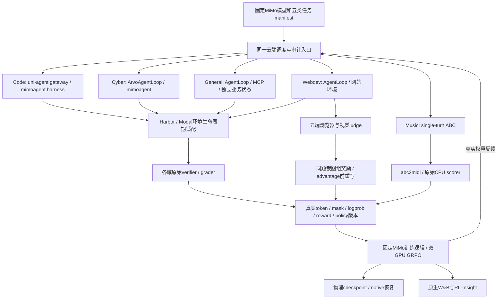

# MiMo 五领域小数据强化学习复现设计

日期：2026-10-01。用户目标：完整覆盖公开强化学习路线和五类任务，可以减少数据量。当前状态：源代码审计及新双卡主机只读核查完成；五域训练尚未完成。本文是新增实现的设计，不能作为训练结果。

## 目标与已有结果

Code、Cyber、General、Visual/Webdev、Music 各自执行真实 policy 采样、原任务评分、有效 GRPO 参数更新、物理 checkpoint、恢复与原生 W&B/RL-Insight 观测。小数据覆盖不要求重现论文分数或全量训练，不把模型启动、CPU grader 校准、五个推理输出当作五域训练通过。

R21 已证明 DSH Code 适配路线：1 个新任务、4 条实际消费轨迹、C4→C5 一次新更新、19 项联合验收；监督运行50分16秒，不是六小时连续训练。Cyber/General/Webdev/Music 尚无本链路训练验收。详见 [R21 运行报告](r21-training-run-report-20261001.md)。

既有 DSH Code 路线保留。新增 MiMo 参考运行路线保留上游 harness、任务与奖励；DSH 不强制包住 Music 或其他原生 AgentLoop。使用 DSH 替代原 harness 的结果单独标记为 adapted，不能填写 reference 验收栏。

## 固定来源与版本

| 工件 | 固定身份 |
| --- | --- |
| MiMo VERL | a2ad9f6160b03ff2d47e59832bfb6b289f37c917；本地只读来源 xDAN-Train-Performance-Verl |
| mimoagent | 467f0a19016f0ac4d63b8d17a1f0da9ba07f232c |
| MiMo uni-agent | c63e0b01c375ebede95e01fe92bc367df24e5bf3 |
| 数据 | XiaomiMiMo/MiMo-V2.6-RL-oss，639865fd3374018d6cb29b9fb82dd531406fcf5f |
| 模型 | MiMo-V2.6-Distill-Qwen-9B，2367e865d009c13ac81713a2878291d33ab28177 |
| 既有 DSH | b2369692ea530007075ebcd18d39fdba0bbd3982、SDK/runtime0.1.3a2 |
| Music评分基线 | ref_full4k.json；SHA afa0ea0d21745aa2f82bb40812e422d3d583165c0d720d268de4ba20cbbc9ed1 |

固定数据盘点：code2698、cyber1000、general989、webdev2093、music1000，共7780行。这些是任务实例，不是7780条已有训练轨迹。尚未对非Code的所有环境资产做可运行验收。

## 架构

Code 使用 uni-agent session；其他四域保持上游的原生生成/AgentLoop接口，不把全部轨迹伪装为 Code session。环境 adapter 替换执行地点，不能改变 grader、工具描述、初始状态和 verifier 隔离。General main/sidecar 在 Modal 需要等价隔离证据；不能把全部隐藏文件塞进学生容器。当前没有可直接复用的已验收 K8s 集群。

## 最小覆盖数据

先固定每类2个独立train任务、1个heldout，共10个train任务、5个heldout。每行记录原Parquet文件/行号/hash、task ID、完整实例和资产digest；具体ID待云端资产核查后冻结，不能填写猜测ID。heldout选择及评测规则在第一次GPU采样之前确定。

| 类别 | 小数据采样目标 | 必须保留的原任务语义 |
| --- | --- | --- |
| Code | 2任务，n4；参考四harness各至少一个真实消费组 | 原仓库镜像、隐藏test patch、原test command；同组单harness，记录实际step-hash路由 |
| Cyber | 2任务，n4，尽量不同项目 | sanitizer crash及function/sanitizer/error_type精确匹配；agent/verify/root权限 |
| General | 2任务，n8；terminal_bench与general_agent各1题 | terminal保留tests_files原测试；业务任务保留MCP/SQLite隔离与rubric/answer_key |
| Webdev | 2任务，n8 | 真build/render/screenshot、query-fit/runtime gate、同题8候选视觉pick |
| Music | 2短prompt，n8，尽量语言不同 | 原ABC生成与abc2midi转换、固定18特征评分；不修改成Code测试 |

固定prompt batch=mini-batch=1，每次optimizer更新消费一个完整同题兄弟组。最低12个训练组、72条实际消费轨迹：Code4组×4 + Cyber2组×4 + General2组×8 + Webdev2组×8 + Music2组×8。Code四harness实际step-hash路由覆盖可能需要额外组。失败、过滤同分组、prefetch不计入72，全部尝试另记。每类至少2次有效新更新，其中一次来自物理checkpoint重新启动后的续步；Code还须覆盖全部参考harness。以实际manifest/消费/更新计数验收，不以运行小时数验收。

不能无限重采样等待奖励方差：每任务最多3轮组尝试作为初始上限，所有失败保留；准入失败则暂停该域并报告原因。不得从组内挑成功成员、改变官方reward、制造fake reward或按heldout结果换题。Music上游不做group filter，也不因修改过滤策略才得到非零梯度；同分组可按原recipe处理，但不能单独证明有效学习。

## 五域执行及奖励契约

### Code

参考入口 scripts/code/train.sh，四harness来自 config/agent/code/mix-four-whitebox.yaml。每个GRPO组保持一个arm，按冻结seed/step-hash记录真实路由。mimoagent原runner依赖旧reward_info_url，与本项目typed TaskResult不同，参考路线使用其固定uni-agent，不在现DSH SessionHandle上补假的兼容字段。原测试评分与环境故障区分，隐藏patch只在评分时使用。

### Cyber

入口 scripts/arvo/arvo.sh → ArvoAgentLoop。工具以agent用户执行，可信grader读取/root/binary，PoC在verify用户执行；只有crash且function/sanitizer/error_type三项精确匹配得1，file不是匹配条件。原服务监听localhost8666。capabilities=[]不等于drop-all或断网。

上游reward/testbed_corrupted类别及失败EOS/0-logprob占位输出须显式标为infra；不能以它们充当真实训练轨迹。REFERENCE_PENALTIES.json为可选profile，默认wrapper未启用，不能默认为已执行。

### General

云CPU实查发布Parquet：989行中mimoagent/terminal_bench64、mimoagent/general_agent925，且64行内外dataset_type均为terminal_bench。两套instance schema不能互换。最低两题分别覆盖这两支；不能只选前两行terminal或只选925行rubric。实际发布数据/资产核查见evidence/r22-five-domain-data-preflight-20261001.json。

入口scripts/general/general.sh的env_actor按真实dataset_type分发，但固定467f registry仅arvo/deepswe/generic/opensource-code，recipe只新增general_agent；terminal_bench尚未注册，是已确认的公开数据/代码兼容缺口。不得重标签成generic（无programmatic verifier）或S3K（缺env_task_dir）。需要显式terminal兼容adapter，完整保留原tests_files/test.sh/reward协议与超时/权限。首行tests_files为JSON字符串，解码为5文件，包括anti_hack_guard、fixtures、test.sh和test_outputs.py；不能仅看文件名推定reward协议。未核完整测试合同前不能启动该分支训练；该结果标reference-compat，不声称未经修改的官方代码原生支持。

925条业务任务：初始workspace、MCP工具定义与独立SQLite状态全部冻结；agent看不到system/verifier资产。原rubric/answer_key于reward阶段进入可信sidecar。默认将连续分数按1.0阈值二值化，连续分数另存；保留invalid=-999的组处理及infra优势归零，不能改阈值让9B更容易过。

judge真实端点/模型/参数与响应元数据冻结，不在Git保存key；gpt-4o-mini只是公开wrapper默认，不代表论文固定judge。配置声明length penalty不等于源码实际执行，实际消费位置必须核实后报告。

### Webdev

入口 scripts/design/webdev.sh。六工具Bash/Read/Write/Edit/Grep/Glob及描述字节保持原样。云端grader对真实工作区重建、渲染、截图。每条轨迹的初始0.0/pending仅占位；必须执行原driver在advantage之前的组奖励重写，才可训练。

训练reward=(pick_norm-query_deduct+2)/3；query<0.2或runtime factor0得0。默认组至少4有效截图；保留n8及8轮Williams排序、至少5轮有效pick。截图/资产trainer和worker真实可读，不能返回虚构路径或缓存其他任务的截图。

视觉judge必须有vision能力且真实可调用。9B policy是否有multimodal processor单独核查；原源码无processor时降为omitted文字提示，必须记录，不能称policy读取了图。若所选task/profile必须让policy读取图像而模型不支持，应拒绝该组合，不能填reference PASS；若固定官方9B/profile本来允许text-only policy配vision judge，则按该明确合同验收。留出使用原单页绝对视觉评分，与训练相对reward分开。

### Music

入口 scripts/design/music.sh，单轮生成ABC，调用原scorer。abc2midi必须在实际Ray reward worker可执行，fenced/bare预检均需0<score<1。原scorer使用18特征/6组、85%基线percentile与15%histogram相似度，再归一化到[0,1]。

直接抽已发布Parquet，避免原builder硬编码N_VAL182与小样本冲突。发布schema没有agent_name/instance_json/index，ability为music_generation，使用src_id作为原始身份；不能以本地builder字段假设拒绝实际数据。原reward不读取prompt约束元数据；bpm/声部/长度遵循度作为独立评测，不改主reward。

## 算法及双卡环境

统一的是模型来源、GRPO路线、资源和审计；各域配置不能统一成现Code YAML。Code/Cyber/General保留不除组std、prompt-mean与原group filtering；Webdev保留原std设置、prompt-mean及组奖励hook；Music保留single-turn与filter_groups=false。lr General2e-6，其余逐域按真实脚本解析，不能全改1e-6。clip0.2与KL/entropy设置按resolved config核查。

当前本仓VERL缺少上游prompt-mean/global weights、部分infra处理及Webdev driver rewrite。因此新增固定MiMo源码运行lane，避免只移植AgentLoop而丢失核心训练逻辑。旧训练树run-src-r20与273依赖环境不改。

优先验证参考fork使用FSDP/vLLM在现273依赖只读环境中的兼容性，配置采用独立Hydra入口；保留原custom训练语义。默认目标为9B full-weight、双卡、CPU optimizer/parameter offload；现DSH LoRA C5不是full-weight参考实验的optimizer起点。逐域保持原模式：Code/Cyber/Webdev/Music为colocate_async，General为sync，不为共用双卡而改变其staleness/group filter行为。若参考fork在现Torch/vLLM失败，建立独立cloud uv前缀并固定兼容包，或启用原SGLang/Megatron；不得在原uv执行无界升级。LoRA仅作明确标记的排障变体，不能静默代替full-weight完成门。

2×96GB并不自动保证全参长上下文可跑：先验证模型架构、tokenizer/template/工具协议、后端支持、显存及CPU预算，再做真实forward/backward/weight-sync预检。仅在源prompt真实可容纳时采用32K初始上下文；不静默truncate超长General prompt。所选任务的缩减context/组大小/backend与上游64卡/长context差异逐项入manifest。

每域从同一固定SFT base独立训练和恢复，避免把顺序串训当作上游五域独立recipe。五域通过之后再设计一个联合policy课程；它不是本轮覆盖前提。

## 新增文件与接口（设计，尚未实现）

| 路径 | 计划职责 |
| --- | --- |
| examples/mimo_multidomain_rl/source-lock.json | reference source/submodule/model/data/scorer固定身份 |
| examples/mimo_multidomain_rl/prepare.py | 五域原schema抽样、assets/image映射、heldout与manifest |
| examples/mimo_multidomain_rl/recipes/{code,cyber,general,webdev,music}.yaml | 原域recipe的显式双卡覆盖，保留各自loss/reward语义 |
| examples/mimo_multidomain_rl/launch.py | 原recipe执行、source/env preflight、唯一run identity与有界时限 |
| examples/mimo_multidomain_rl/run_all.sh | 顺序五域阶段；成功后接续，异常保存/清理，不只留后台running |
| uni_agent/tasks/mimo_reference/modal_environment.py | 原execute/copy/as_user/lifecycle接口的Modal适配，Harbor归属与清理 |
| uni_agent/tasks/mimo_reference/general_environment.py | main/sidecar/MCP/SQLite隔离合同，不暴露隐藏资产 |
| uni_agent/tasks/mimo_reference/terminal_bench_environment.py | 显式注册缺失terminal分支，原tests_files安装/执行/评分/超时合同，不改成rubric或无verifier generic |
| examples/mimo_multidomain_rl/acceptance.py | 每域消费/有效更新/恢复/checkpoint/W&B/Insight完整审计 |
| tests/uni_agent/examples/test_mimo_multidomain_*.py | loss/group/infra/权限/运行终态等必要语义云CPU回归 |

概念合同：TaskManifest(domain, source_revision, row_sha, task_id, asset_sha, image_digest, split)；RolloutEnvelope(domain, group_uid, task_id, harness_revision, policy_version, native_token_ref, finished, infra_category)；GradeReport(verifier_revision, raw_reward, training_reward, evidence_refs, group_grade_ref)；Acceptance(stage, source/env/config_sha, consumed_ids, parameter_optimizer_diff, checkpoint_manifest, wandb_ref, insight_refs)。实施时对照真实上游类型，不能将这些拟议名称当已有API。

## 云端执行和资源纪律

新用户指定SSH：157.157.221.177:16160。2026-10-01 07:32UTC只读实查两RTX PRO6000 97887MiB、0显存/0利用率；网盘uv与C5目录存在。新/root/mimo-private不存在；新Pod平台ID/资源上限尚未确认，不能复用旧cost guard或过期deadline。

uv路径 /workspace/verl-uni-agent-harbor-opd-rl/envs/ua-verl-py312-vllm023-ws1：Python3.12.3、Torch2.11、vLLM0.23、Transformers5.8、Ray2.54.1、Harbor0.16.1、Modal1.5.5、W&B0.30、RL-Insight0.3。SGLang/megatron-core/mbridge未安装。C5十五文件大小列表存在，但本次尚未重新全SHA验证或加载。

先完成CPU数据/资产/评分/依赖预检，再用GPU；执行顺序Music→Code参考→Cyber→General→Webdev，阻塞域不冒充成功，独立可运行域继续。新GPU截止按明确新资源窗口，不重计旧六小时；任务终态后自动接续待运行域，全部结束则保存验收和资源清理。CPU准备长期阻塞时报告GPU空闲及恢复材料，按当前已约定时限处理，不提前停止用户主机。

Mac只编辑/Git/Ruff/SSH/小报告，模型、镜像、依赖和测试全部云端。只管理本次owned进程/Modal资源，不global ray stop/pkill，不动其他会话。凭据root真实0700/0600，网盘只放加密备份；明确文件allowlist，不glob私有JSON。W&B/Insight不能靠补写历史制造通过。

## 测试与完成门

1. 云CPU：固定source/config导入、原schema/资产解析、各域正负及infra grader；General权限/独立状态，Cyber不能改root binary；Music实际worker转换；Webdev真实render/pick。
2. loss语义：prompt-mean全batch权重与DP/microbatch不变性；General sentinel；Webdev reward rewrite在advantage之前；零差异组不能证明更新；失败占位tokens不能计消费。
3. GPU预检：两个rank实际参与，固定模型forward/backward及权重反馈，按最终resolved config核内存/TP/world-size；源码/PYTHONPATH不能落回旧editable仓。
4. 每域真实10项门：固定任务及资产、原harness、真实policy token/mask/logprob、原始grader、唯一消费及policy版本、非零优势/有限梯度/参数与optimizer变化、checkpoint全SHA、物理重启恢复后的新步、native W&B API对账、RL-Insight当前run真实Prom/Tempo。heldout另外保存原评分路径结果，不将训练reward解释为能力提升。
5. ALL_DOMAINS_PASS仅在五域上述证据齐全时成立；既有Code adapted PASS和新reference PASS分栏。保存所有原始失败、尝试数、有效消费数、新更新数、计时/空闲时段和成本边界。
6. 每次push前精确干净commit全仓ruff check .与ruff format --check .；云CPU测试只验证必要语义并记录实际来源/覆盖，不在Mac运行。

## 源码证据入口

- 上游本地固定git show：scripts/{code,arvo,general,design}、recipes/{code,arvo,general,design}；与当前fork差异已实际搜索。
- prompt-mean：verl/trainer/ppo/core_algos.py:1157；General invalid处理:306；V1 group filter:trainer_base.py:428。
- Webdev组重写：trainer_base.py:1888、1994、2008、2053；group_reward.py:69；group_pick.py:21、88。
- General环境：general_agent/environment.py:36、47、261、483；env_actor.py:165、345。
- Music：music/build_parquet.py:55、scorer/pipeline.py:171、229、scorer/score.py:20、scorer_precheck.py:55。
- [固定Cyber grader](https://github.com/XiaomiMiMo/MiMo-Agent/blob/467f0a19016f0ac4d63b8d17a1f0da9ba07f232c/src/mimoagent/environments/datasets/resources/server_arvo.py#L155)；[官方五域README](https://github.com/XiaomiMiMo/verl/blob/a2ad9f6160b03ff2d47e59832bfb6b289f37c917/README.md)。
