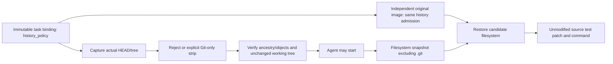

# MiMo history admission and bounded verifier calibration

## Goal

Prevent a task agent from recovering a reference fix from Git history while
preserving the exact original HEAD, HEAD tree, and working-tree bytes. The
agent workspace and separate verifier must use the same explicit policy.

## Fixed upstream evidence

Upstream revision: `467f0a19016f0ac4d63b8d17a1f0da9ba07f232c`.

- [opensource_code.py](https://github.com/XiaomiMiMo/mimoagent/blob/467f0a19016f0ac4d63b8d17a1f0da9ba07f232c/src/mimoagent/environments/datasets/opensource_code.py):
  setup captures the image's real HEAD and rejects commits outside that HEAD's
  ancestry. Its default is `none`; documented fallback is `git_leak_prevention: strip`.
- [base.py](https://github.com/XiaomiMiMo/mimoagent/blob/467f0a19016f0ac4d63b8d17a1f0da9ba07f232c/src/mimoagent/environments/datasets/base.py):
  detach, remove branches/remotes/non-tag refs, retain ancestor tags, expire
  reflogs, then one GC with `gc.pruneExpire=now` and `gc.cruftPacks=false`.
  Downloaded SHA-256: `c500f341b9291772d6c0d1a190f2e9136db68c97eac9d21919812f9a097f372a`.

The first real calibration rejected task 001661 with
`image_history_not_truncated` before running tests; it produced no reward.
Both allocated sandboxes were terminated. Production's original `capture_base`
omitted this admission check. Removing the calibration check would conceal the
production defect, so the production policy must be fixed instead.

## Contract and file changes

- `mimo.py`: `history_policy` defaults to `reject`; `strip` is an explicit
  operator-owned choice and participates in the binding hash.
- `prepare_tasks.py`: write the chosen policy explicitly into generated tasks.
- `mimo_workspace.py`: bounded Git admission/cleanup, before/after identity
  evidence, CLI policy option, and the same admission before independent restore.
- `mimo_artifacts.py`: pass the frozen policy to trusted helpers and retain
  capture evidence in operator state.
- `calibrate_verifier.py`: exercise this production policy and preserve the
  original test bytes, command and declared timeout. The outer 600-second
  budget is an infrastructure limit and must not create a zero reward.

Git cleanup may change only the independent task sandbox's `.git`. No repository
reset/checkout may discard existing compatibility changes. Preserve old ancestor
tags, verify no out-of-ancestry commits remain recoverable after GC, and fail
closed if cleanup cannot be proved. This lane does not silently switch to a
hidden `.git` because snapshot/restore relies on an explicit baseline identity.

## Verification plan

- Default reject makes no mutations when future refs or recoverable future
  commits exist.
- Explicit strip removes future branches, remotes, tags, reflogs and unreachable
  commit objects; ancestor tags remain usable.
- HEAD, tree, dirty text/binary files, permissions and symlinks remain unchanged.
- GC/verification failure aborts before agent execution.
- Remote CPU regression checks cover binding/transport/prepare integration.
- Real 001661 calibration records before/after history and tree identities,
  original-image failing baseline, restored-workspace result equivalence, and
  independent termination of every sandbox. A positive control is separately
  labeled as an operator calibration fixture, never a training example.

## Verified result — 2026-09-28

Remote CPU checks: **66 passed**, targeted Ruff check and format passed. Tests
cover default rejection, future refs and reflog-only recoverable commits,
ancestor tags, dirty/binary/executable/symlink preservation, failed GC, and the
same explicit policy during independent restore. No tests or builds ran on Mac.

[Real calibration evidence](evidence/mimo-verifier/calibration-r2.json) records
the fixed original and DSH image digests. All three task sandboxes contained
**82 commits outside the base ancestry before strip, zero afterward**, both as
reachable commits and physically recoverable commit objects. The actual base
`125729aed4a777af6ceb6ace5744f53db9d7933c`, tree
`450112c0a9d66c5797e4758a4f5a592969aa9dba`, and original working-tree fingerprint
`8fd0b5138fea2840cf20d39cfc9a97f0bcc8b118940d485f69d5b0b562164b6f`
were preserved.

| Real control | Result | Evidence |
|---|---|---|
| Original image, unchanged task | Graded, reward 0, exit 2 | [Direct baseline](evidence/mimo-verifier/baseline-direct.json) |
| DSH filesystem snapshot → original image restore | Graded, reward 0, exit 2 | [Restored baseline](evidence/mimo-verifier/baseline-restored.json) |
| Independently authored public-only patch → same transport/verifier | Graded, reward 1, exit 0; 9 tests passed | [Positive control](evidence/mimo-verifier/candidate-restored.json) |

The baseline lacks `friend_set_for`, which the public problem explicitly asks to
implement. Both baseline paths fail at that import. The positive control proves
the original testbed works without changing its test patch, command, dependencies,
or declared 1800-second timeout. The outer operator deadline remained 600 seconds;
all three CPU sandboxes were independently terminated in `finally`.

The positive patch was authored by a separate agent given only the public problem
and original `friends/models.py` / `friends/__init__.py`; its [provenance](evidence/mimo-verifier/public-only-candidate-001661.provenance.json)
records SHA-256 `2229cbd226fa8f2add77b39247ecea70832cdcb748f60239f70e60162d1dfdbc`.
It is a verifier calibration control, not model output or training data. This
evidence establishes task 001661 history admission, workspace transport and
reward discrimination; it does not establish an RL optimizer update or dataset-wide
compatibility.

Production/calibration use the same trusted workspace source, SHA-256
`a63bb29c3185f1ef15f8e9de8b35930ebaf0426b63d9d2d3cf3d1cb83544ddde`.
The deployed history patch archive is `history-admission-r2.tar.gz`, SHA-256
`e0432fda9ad4d9a00788b4be738c77c0e04d7706304ba617e63f40405840943d`.
