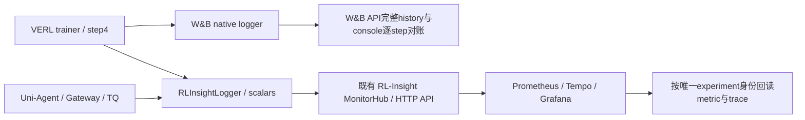

# MiMo 原生 W&B 与 RL-Insight 接入

## R18：运行级绝对截止修正

R18 最新授权窗口为 2026-09-30 00:11:09UTC 至 07:11:09UTC（1790752269，共 7 小时）；最初 2 小时窗口及其真实 probe 保留为历史证据，不作为当前准入。旧 helper 内固定的 1790709401 已过期，会令终态回执预算为零。launcher 新增明确参数 `--observability-deadline-unix 1790752269`，仅允许与 `--observability-wrapper` 一起使用，并写入实际子进程覆盖项 `++trainer.observability_deadline_unix=1790752269`。R18 preparation/preflight 必须与 run-spec 截止一致。helper 验证有限正数并跨 Ray 配置传递给 `wait_for_ack(deadline_unix=...)`，仍保留 45 秒上限和 180 秒清理预留；不随重启重计。

缺少新字段的历史运行保持旧默认截止，不改已冻结历史源码。launcher 同时增加显式 opt-in `--token-journal-dir <absolute-private-path>`，通过 `++ray_kwargs.ray_init.runtime_env.env_vars.UNI_AGENT_TOKEN_JOURNAL_DIR` 传播给原生 Ray workers，默认不开。journal hook 独立负责私有目录权限与脱敏；不改变生成和奖励语义。

本 slice 修改 `mimo_observability.py`、`examples/harbor_opd_rl/launch.py` 及两者已有测试；R18 preparation 与 journal hook 由独立 slice 接入。云 CPU 回归覆盖旧默认、晚于旧截止的新窗口、清理边界、非法值、Ray runner 参数传递及实际子进程命令重新组合。新 helper 使用独立身份在只读源码目录执行实际 Hydra bootstrap，证明真实配置包含截止和 journal 路径，元数据写到私有目录且在明确 CPU guard 处退出；不启动 GPU、Ray 训练或重启共享观测服务。

用户明确要求用 W&B API 客观检查本会话训练，并补充「要注意集成 wandb verl-insight」。项目实际模块名为 `rl_insight`。本计划落实该要求，沿用已批准的双卡 separate_async、真实数据与固定截止，不扩大模型或训练预算。

## 13:08 UTC 用户追加六小时授权

用户连续明确「继续」「注意gpu服务器不要太早关闭」「继续延期6个小时」。新绝对截止为原截止加21600秒：**1790709401 / 2026-09-29 19:16:41UTC / 2026-09-30 03:16:41新加坡时间**。保留GPU Pod，不执行关机/删除。旧r10冻结源码与旧r11准入拒绝证据保持原样，新r11脚本使用独立v2 bundle。

通用controller已有六小时上限，无需扩宽它：先完成CPU监控预检、测试及代码冻结，r11在13:16:41UTC以后按`--max-run-seconds21600`进入新窗口，仍提前180秒结束训练以清理所属任务。后续重启不得把新截止继续后移。

## 已确认的缺口

r9/r10 的实际 logger 只有 console。W&B 已有凭据可读，但配置项目无对应可见 run；不能借其他实验曲线或事后补传宣称本轮原生观测已通过。r10 已 exit0 并保存 C3，奖励 [0,1,1,1]、梯度0.1484375；完整恢复及有效更新另用原始证据审计。

## 原生接入方案

- 新 r11 从完整 r10 C3 恢复，目标绝对 step4。固定 actor1/rollout1、NCCL、32K、20480、n4、LoRA，继续原任务。
- logger 显式 `[console, wandb, rl_insight]`。W&B entity `xdan-ai`，使用已有项目 `xDAN-Verl-Uni-agent-Harbor-rl-opd`；run ID/name 与 r11 绑定，拒绝意外续接其他 W&B run。
- 原生 `main_ppo` 在 Ray 初始化前传播 `VERL_RL_INSIGHT_ENABLE=1`；按已安装0.3.0实际接口绑定既有18080服务及独立 experiment 身份。开启 rollout/TQ metrics 所需开关。服务只复用，不重启他人共享监控。
- 固定273项 uv环境及独立CuPy overlay不变。不在Mac安装、启动服务或运行模型。任何依赖/服务/API缺失先报告，不静默降级并宣称接入成功。
- native TaskRunner保持原训练实现。可选operator wrapper在native finish之后、Ray任务退出之前，最多45秒等待Prometheus确认本实验终步、有限梯度与奖励；实际响应落盘，超时明确失败。该等待不伪造训练数据。
- 真实CPU探针v2已证明Ray序列化可用，但发现仅保留TaskRunner不能保住MonitorHub：rl-insight0.3.0的finish丢弃client，Hub实际是非detached的job-scoped actor（其docstring过时）。wrapper必须在启动原生TaskRunner之前取得并保留原生Hub handle，使用同一trainer.rl_insight配置与Ray job；待真实scrape回执完成后随自身生命周期释放。v2失败证据保留，修复后使用新的v3合成实验身份验证，不能复用旧实验样本冒充新回执。
- 新授权唯一截止1790709401（2026-09-29 19:16:41UTC），不重计；所有新训练必须保留清理时间，不足窗口即不启动。r11按r10实测约46分钟全程设置至少2700秒剩余窗口准入（估计而非完成保证），继续保留180秒清理预算。
- r9/r10历史数据保留原始日志及审计报告，不创建伪装实时的 W&B补传run。凭据继续只存在现有私有位置，禁止入日志/配置/提交。

## 文件与合同

- `examples/mimo_dsh_rl/mimo-9b-observed.yaml`：在已验证 separate recipe上启用原生logger和metrics；不改已有冻结运行配置。
- 同名docs目录内 r11 preparation/preflight：绑定新source manifest、真实C3、独立run/controller/Ray/ports、原绝对截止及精确监控环境。
- 对应tests：配置组合、日志后端/身份/预算/恢复合同、监控预检失败关闭。
- 同名 `evidence/`：W&B只读审计、CPU配置回归、原生logger/后端回读、r11启动与真实history对账。

## 验证顺序

1. 完成r10原始batch/model/optimizer/恢复证据审计并清理所属资源；保存parse-error等真实异常。
2. 云端配置测试，检查W&B认证、原生RL-Insight模块和服务接口。若做合成通信探针，必须使用明确preflight标签，不计作训练。
3. 冻结新source，CPU真实tokenizer/依赖/恢复/monitor检查，然后启动r11；不改r10字节。
4. W&B必须出现绑定r11的原生run；RL-Insight按相同身份查询真实端点/事件，不能只看端口可达。
5. step4完成后W&B `scan_history(keys=None)`回读全量记录，与console逐指标比较，核有限梯度/loss/奖励、策略版本3及checkpoint。RL-Insight回读该experiment真实scalar/trace；不同平台指标命名转换需明确记录。

## 判定边界

监控集成、训练更新、独立恢复、能力提升为四个不同结论。一次小样本续训只能证明链路与学习信号；缺W&B history、缺RL-Insight实际事件、指标对账失败任一项都不能宣布观测验收完成。

## r11 实际入口失败与 r12 接续

r11于13:44:57UTC在Hydra创建相对outputs目录时PermissionError，尚未进入Ray/模型训练，exit1；该身份与源码完整保留，controller/archiver已停止，GPU Pod保留。launcher改为显式私有`launch.json`同目录`hydra/`输出，冻结源码继续只读。真实入口已在0555源码目录成功创建Hydra元数据，再按预设use_v1=false guard退出；这个CPU路径检查不等于训练。

r12使用独立身份/ports38680–38683/Ray目录/W&B run `mimo9b001661r12`，仍从r10 C3恢复至绝对step4，复用原生Hub保留修复与既有后端。截止仍1790709401，不因启动失败重计。
