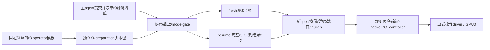

# r9 fresh / resume 显式启动准备

r8 于 08:29:23 UTC 因 entropy logits OOM 退出，当前无 C1/C2。故当前只可在显存修复验证后选择 fresh；不伪装成续训。用户固定截止为 2026-09-29 13:16:41 UTC。



代码文件：本目录 `mimo_r9_preparation.py`；回归测试 `tests/uni_agent/deployment/test_mimo_r9_preparation.py`。模块的 stage 操作仅读取固定模板、生成新目录中的脚本，不生成spec/token、不操作GPU、不修改r8。运行时要求显式 `MIMO_R9_MODE=fresh|resume` 与完整40位 `MIMO_R9_SOURCE_COMMIT`，不提供默认模式/源码身份。

新source必须为 `run-src-r9`，清单 `integration-check/source-r9-manifest.json` 的commit及每个列出文件的bytes/SHA必须匹配；主agent提交冻结后才能运行生成脚本。清单至少覆盖controller、launcher及MiMo recipe。

prepare仅沿用r8已验证转换/传输流程，独立r9路径/身份/端口38650..38653与新credentials；沿用已验证GPU discovery/SSH host key，固定绝对deadline替代旧4800秒lease。controller命令显式 `--max-run-seconds 18000`。driver的wall为固定deadline减当前时间再减180秒cleanup余量，没有新的五小时滚动窗口。保留Pod；不使用删除Pod的watchdog。

resume除C2目录外必须具备非空、非symlink的model/optimizer/extra_state/data及latest iteration=2。仅证明结构完整，真实load/optimizer/rng/data恢复与step3有效更新仍按effective-update-audit-plan逐项验收。fresh不传resume参数。

测试：截止重算/过期失败、源码摘要错配、显式mode、fresh2/resume3、C1冒充C2/缺optimizer拒绝、模板摘要固定与独占输出目录、生成Python可编译。仅云端CPU运行。

## 精确操作入口（主线程执行，本slice未执行）

先提交已测试的entropy修复、5小时controller和本helper，再冻结 `run-src-r9`。源码清单必须包含 `verl/verl/workers/engine/fsdp/transformer_impl.py` 的实际bytes/SHA，不能仅冻结父仓库gitlink。manifest的40位commit与环境变量一致只证明身份绑定，主线程还须从该commit导出源码并核所有文件摘要；不把任意填写的commit当作来源证明。

CPU控制节点使用固定Python、显式模式与实际完整commit（此处不提供伪commit）：

```sh
export MIMO_R9_MODE=fresh
export MIMO_R9_SOURCE_COMMIT="$REVIEWED_FULL_COMMIT"
export PYTHONPATH=/workspace/mimo-dsh-rl-20260928/run-src-r9:/workspace/mimo-dsh-rl-20260928/run-src-r9/verl
export CUDA_VISIBLE_DEVICES=
/workspace/verl-uni-agent-harbor-opd-rl/envs/ua-verl-py312-vllm023-ws1/bin/python /workspace/mimo-dsh-rl-20260928/audit-code/r9-preparation/prepare-r9.py
```

完成prepared证据核对后，CPU节点controller的准确入口为：

```sh
/workspace/verl-uni-agent-harbor-opd-rl/envs/ua-verl-py312-vllm023-ws1/bin/python -m deployment.services.harbor_run_controller --run-spec /root/mimo-private/run-spec-r9.json --max-run-seconds 18000
```

仍需主线程保持其受监督运行、PID/log落盘、authenticated health核验。随后在GPU节点完成r9 tokenizer预检与nativeIPC，确认 `gpu-preflight-r9/status.json` passed、tests=1、skipped/errors/failures=0，才显式执行新driver。driver运行环境同样携带上述mode/commit/PYTHONPATH，入口 `audit-code/r9-preparation/launch-r9-driver.py`，其内部限定GPU0。上限是固定deadline减当前时间减180秒清理余量；controller截止仍为13:16:41 UTC。

重启恢复发现08:39 UTC旧stage包已存在，仅含脚本与manifest，不代表run已准备或开始。旧包须保留并用时间后缀归档，再独占生成最终包；不能把目录存在误报为训练成功，也不能覆盖旧审计证据。

## 验证结果（2026-09-29 08:48 UTC）

云端固定Python、`CUDA_VISIBLE_DEVICES=''`，使用既有隔离 `coverage-tools-scoped`，未安装或修改共享uv。最终25 tests passed / 0.47s；93/94 executable lines、17/18 branches、combined coverage 98.214%。初次coverage调用缺模块的原始失败单独保存，最终复用工具路径后通过。早期RED与12-test GREEN原始日志也保留。

真实三个r8模板SHA核验通过；最终四脚本生成成功，outer/inner gpu_code均AST通过。08:39草稿完整保留于云端 `audit-code/r9-preparation-draft-20260929T084811Z`；最终包为 `audit-code/r9-preparation`。检查CPU节点run-spec、registration-token、worker-token、launch、controller-r9均不存在，共享卷runs/r9不存在。此slice没有准备或启动r9。

小证据见 `evidence/r9-preparation-20260929/validation.json`、`coverage.json`及raw logs。helper SHA256 `de25ebfc09fb5f7de6b3deb95307792ea97623bbbbba47ba19aa0eaae141c6c7`；tests SHA256 `f52d4ec2d4b7052e4f80f55bc500a61ba26dd5ae91700537cc2029cfddcfd5ad`。所有运行仍需主线程完成真实源码提交冻结与预检后显式启动。
