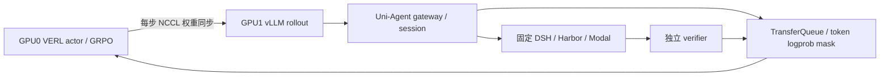

# MiMo 9B separate_async 双卡验收

用户于 2026-09-29 明确选择「那就走 separate_async」，批准此前呈交的一卡训练、一卡 rollout 方案。本文件细化已批准方案，不扩大训练时限。

## 目标与约束

- 在既有 11403 双 RTX PRO 6000 上运行 actor 1 GPU + standalone rollout 1 GPU；不操作其他 Pod。
- 固定 MiMo 数据、模型、DSH、273 项 uv 依赖与原始 verifier；32K 总上下文、20480 生成预算、n=4、LoRA 保持。
- 使用 separate_async、每步权重同步、NCCL backend。首次关闭 hybrid_rollout.enable_switch，便于核验角色和物理卡映射。
- 保留 r9 原始证据；新 run/controller/Ray/session/source identity。若 r9 C2 完整，优先从 C2 恢复到绝对 step 3；不得把 fresh 冒充恢复。
- 绝对截止 1790687801（2026-09-29 13:16:41 UTC），训练预留 180 秒清理；不因切换重计时。保留 Pod，实例仍计费。
- Mac 仅编辑、Git、静态检查和 SSH；所有测试、通信探针、张量检查、模型运行均在云端。

## 架构

GPU 编号为目标布局，验收以实际 Ray placement、worker PID 和 GPU UUID 为准。分离不等于 actor 跨两卡分片，不保证降低 actor 自身的显存峰值。

## 文件与合同

- `examples/mimo_dsh_rl/mimo-9b-separate-async.yaml`：显式双池与参数同步配置，复用预算终态合同。
- `docs/verl-uni-agent-harbor-opd-rl/mimo_r10_preparation.py`：冻结来源、新运行身份、C2 恢复和绝对截止校验；仅生成脚本与准备，不隐式启动。
- 对应 `tests/uni_agent/`：配置解析与准备门禁回归。
- 本目录 `evidence/`：CPU 回归、实际 NCCL 探针、双卡启动与最终验收脱敏报告。
- `tasks/verl-uni-agent-harbor-opd-rl/{notes,lessons,handoff}.md`：交接与实测状态。

资源合同为 trainer.nnodes=1/n_gpus_per_node=1、rollout.nnodes=1/n_gpus_per_node=1、tensor parallel=1；进程可见两卡。`train_batch_size = parameter_sync_step * ppo_mini_batch_size` 必须成立。naive backend 不可用于 separate_async。所有 budget/admission/receipt/version 断言保留。

## 执行与测试计划

1. 回读 r9 checkpoint/消费组/终态，保留证据；在进程身份核实后结束本轮所拥有进程，停止其 controller/archiver，不全局 kill Ray。
2. 云端 CPU 验证配置、准备门禁、source hash、依赖版本、恢复文件完整性和截止；静态检查通过后提交推送。
3. 两卡空闲后以固定环境运行真实跨卡 NCCL 权重传输探针；失败则诊断，不绕过或替换为假传输。
4. 冻结新来源并启动新身份。核 actor/rollout 分属两张物理卡、同步版本及 batch/receipt 对齐。
5. 验收奖励差异、正负 advantage、有限非零梯度、LoRA 参数/AdamW 状态变化、checkpoint 与独立恢复。r9 若有完整 C2，r10 直接承担独立恢复验收。
6. 原截止前终止所属任务并保全证据；及时 commit/push，两项全仓 Ruff 检查必须通过。

## 风险与判定

已知 r9 C1 奖励全零，仅机械流程证据。r9 step2 轨迹组奖励 [1,1,0,0]，写本文时尚未确认 C2。不可凭预取轨迹认定已消费/更新。NCCL、LoRA 同步及异步恢复必须实际测试；分离不能自动修复训练阶段 OOM。时间窗口不足时诚实报告未完成，不降低验收条件。
