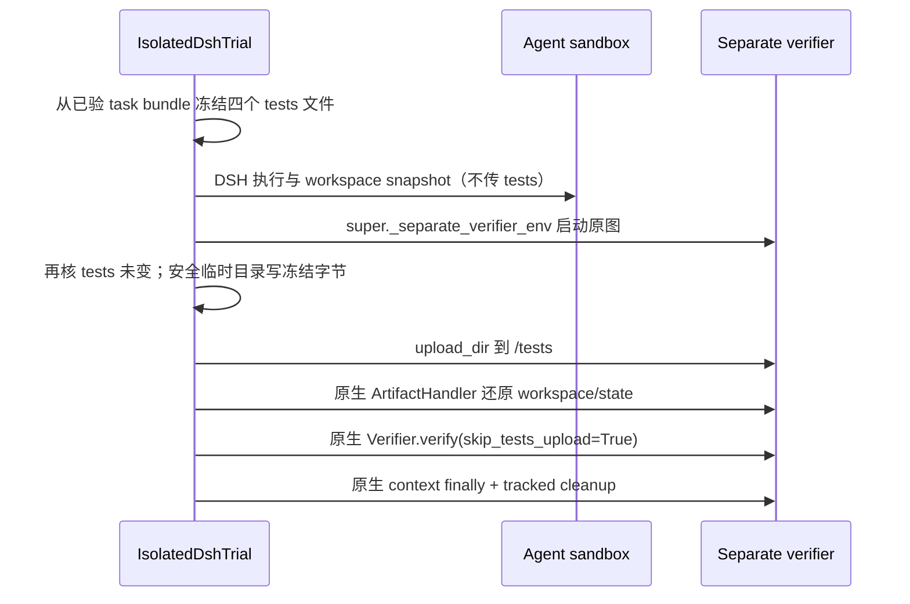

# MiMo separate verifier 隐藏测试注入修复

2026-09-28：已获批准的真实集成 bugfix；不修改共享 Harbor、活跃 run-src-r4、原图 digest 或测试语义。

## 故障

Harbor 0.16.1 的 `Trial._run_separate_verifier` 固定传 `skip_tests_upload=True`，假设独立 verifier 镜像已内置 `/tests/test.sh`。MiMo 使用原始任务镜像，隐藏测试在冻结 task bundle 内；生产缺少注入，实际产生 `test.sh: No such file or directory`，最终 `RewardFileNotFoundError`。早先手动 calibration 自己上传测试，未覆盖这个真实编排分支。

## 最小修复与隔离合同

只在显式 MiMo strategy 覆写 `_separate_verifier_env` contextmanager；其余 lane 完全委托父类。保持四文件 `test.sh/test.patch/verification.json/verifier.py`，拒绝链接/特殊文件/意外路径，冻结及上传前复核内容。临时目录私有、文件0600；Harbor 原生 verifier 负责 chmod/运行。使用冻结字节上传，避免校验后源文件变化改变实际载荷。

executor 已在创建 trial 前及结束后按请求 TaskRef digest 校验完整 task tree；新 tests 快照位于这两个准入门之间，并额外在上传前复核。模型不能写 host task bundle；隐藏测试仅进入独立 verifier。原 context 的 finally 保证注入失败也走退出与 tracked 资源确认，失败仍属 infra，不伪造 reward=0。

## 文件

- `uni_agent/tasks/harbor_dsh/isolated_trial.py`：冻结 tests 与 MiMo 专属 context hook。
- `tests/uni_agent/tasks/test_mimo_verifier_injection.py`：真实 Harbor separate verifier/Verifier 调用的 backend-double CPU 回归，agent 隔离、内容变更/路径拒绝、失败清理；`test_mimo_harbor_lane.py`补齐固定四文件fixture。
- 独立云端 audit probe：固定原图与 public-only candidate，调用生产 `_run_separate_verifier`，不手工替代 verifier 执行，不进入训练源码。

## 验证

1. 新测试先重现原始 skip=True 路径下 missing test/reward，再修复；保留旧 isolated/MiMo 回归与 Ruff。
2. 云端 CPU + Modal 实际 baseline0/candidate1，使用生产 `MimoWorkspaceArtifacts` capture/snapshot/restore 与 native verifier；确认 agent `/tests` 不存在、verifier 收到完整冻结文件、reward/receipt 合法以及全部沙箱终止。
3. 真实探针是 pipeline calibration，无模型/GPU推理，不计作成功 RL 更新。新训练身份/源码冻结和 GPU 运行由主线程管理。

## 已验证结果

新增测试先复现原缺失入口，修复后96项CPU回归通过，Ruff双检查通过，isolated_trial.py模块覆盖率94%。云端真实原生路径复验：baseline reward0/原测试exit2，固定public-only candidate reward1/exit0；两例测试文件SHA均与TaskRef匹配，agent前后均无test.sh，4个Modal sandbox全部确认停止。结构化证据见`evidence/mimo-verifier-injection-native/status.json`。

第一次真实探针在App.lookup因未加载Modal凭据失败，未分配sandbox；随后显式加载已有私有`MODAL_CONFIG_PATH`，在全新输出目录完成上述校准，保留第一次失败，不计为通过。
