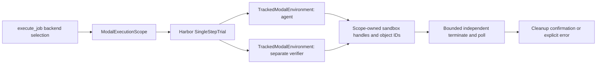

# Harbor Modal resource ownership: implementation slice

This slice connects an optional Harbor 0.16.1 tracked Modal environment to the
existing Worker → executor → isolated Trial path. Docker remains the default.
Controller ingress, frozen registry releases and real cloud execution are still
separate pending integration steps; CPU tests do not launch sandboxes.

## Goal and architecture

Harbor retains ownership of task and verifier sequencing. ContextVar isolates
collectors between concurrent jobs and propagates to Harbor-created asyncio
children. No process-global persistent resource registry is introduced.

## Verified source contracts

- Harbor 0.16.1 cached wheel metadata and source:
  `/Users/gumpm5/.cache/uv/archive-v0/GhbgF7AXg2sb3NAv/`.
- `harbor/environments/modal.py::_create_sandbox` accepts keyword-only
  `entrypoint`, `block_network`, `experimental_options`, returning a Modal Sandbox.
- `_ModalStrategy._teardown_sandbox` catches terminate/wait errors and clears the
  environment's `_sandbox` in `finally`. Therefore `_sandbox is None` is never
  cleanup proof.
- `harbor/trial/trial.py::_separate_verifier_env` copies the runtime environment
  configuration, preserving its import_path, so the same fixed subclass observes
  both agent and verifier resources. Verifier stop errors are also swallowed.
- Installed Modal SDK 1.5.5 source was inspected at
  `tinker-cookbook-opd-rl/.venv/lib/python3.12/site-packages/modal/sandbox.py`.
  `terminate.aio()` requests termination; `poll.aio()` returns None while running,
  otherwise an integer exit code. SDK maps timeout to 124 and termination to 137.
  Nonzero exit is still terminal for cleanup; it is not task success.
- `wait(raise_on_termination=False)` still raises on sandbox timeout. This module
  therefore uses bounded polling for independent confirmation, instead of treating
  wait exceptions or environment reference clearing as cleanup evidence.

## API and file changes

- `uni_agent/tasks/harbor_dsh/modal_environment.py`:
  `TrackedModalEnvironment` is the fixed EnvironmentFactory import path.
  `async with ModalExecutionScope(cleanup_timeout=..., poll_interval=...) as scope`
  owns creation and cleanup. `scope.cleanup_confirmed` becomes true only after
  all recorded resources have independently returned integer poll statuses and
  no allocation uncertainty remains. `scope.evidence` contains resource identities
  and confirmed terminal codes, without SDK credentials.
- `tests/uni_agent/tasks/test_harbor_dsh_modal_environment.py`: fake SDK contracts.

A missing scope or wrong Harbor version rejects before provider allocation.
Allocation runs as a scope-owned task so parent cancellation cannot discard a
successfully returned handle. Scope exit waits for tracked allocation, requests
cleanup for every resource, and bounds work by the cleanup timeout. Failed or
indeterminate allocation prevents cleanup confirmation even if known resources
are terminated. Nested active scopes are rejected; parallel sibling scopes remain
independent. Scope exit prevents new allocations from inherited late child contexts.

## Failure and verification plan

CPU fakes test agent/verifier collection, parallel scope isolation, missing scope,
wrong Harbor version, creation failure, cancellation during allocation, terminal
codes including 124/137, terminate failure, never-terminal timeout, idempotent
cleanup, and late creation after closing. No authenticated Modal call is permitted
in these tests. Real provider termination and GPU/controller connectivity remain
separate deployment acceptance gates.

The executor retains strict task/route/image/artifact policy, wraps trial.run and
cleanup in this scope, and requires observed agent and verifier resources before
accepting a successful trial. Zero-resource scopes cannot prove
that a trial ran. Docker backend behavior is unchanged by this slice.

## Executor integration contract

The operator selects `environment_backend=docker|modal`; requests cannot select a provider.
Worker origin validation remains Docker-to-host HTTP for Docker. Modal requires a public
HTTPS hostname origin (no credentials/path/query/fragment), later combined with the exact
registered Gateway session path. Internal request/registration identities stay unchanged.

The Modal runtime uses only the fixed tracked class, delete=true, bounded CPU/RAM/lifetime
and no arbitrary provider kwargs. Frozen tasks must have no Compose files, no student file
artifacts (initial route is the existing host-side T2 trace artifact contract), a pinned
registry `image@sha256:...` matching the approved release digest, agent network allowlist
containing only the Gateway hostname, and a separate no-network verifier. Network phase
overrides and sandbox GPU allocation are rejected. This is a deliberately explicit supported
contract; Docker file-artifact support remains unchanged.

Changes: small environment_backend helper; Worker/provider forwarding; executor scoped
Modal cleanup and task checks; isolated Trial fixed-class allowlist; operator launch fields.
Tests must exercise actual wrapper dispatch and reject untracked Modal, altered registry
pins, Compose/DinD, network override, invalid origin and missing cleanup evidence.

## Failure acknowledgement and current evidence

A failed or cancelled trial produces `CleanExecutionRejected` only after independent
cleanup confirmation; Modal records all actually created resources in
`modal-cleanup.json`. Failure before verifier creation does not require an invented
verifier resource. Successful execution requires both expected sessions. Unknown
cleanup remains a failure without acknowledgement. Worker preserves acknowledgements
received during timeout unwinding and seals a cancelled job with no artifacts or
reward. Docker failure inventory is shielded from repeated cancellation and has an
independent 100-second total bound. Real cloud reachability remains unverified.

Final integrated CPU run: **191 passed in 3.56s**, including actual Harbor 0.16.1
Trial construction, mocked Modal SDK lifecycle, executor, Worker and HTTP regressions.
Log: `/private/tmp/uni-agent-modal-integrated-tests-r3.log`. No provider calls were made.
