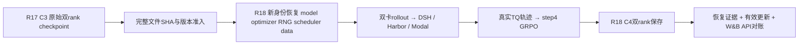

# R18 同双卡独立恢复验收

状态：准备中；用户2026-09-30继续使用11403同服务器，固定窗口2026-09-29 23:51:29 UTC至2026-09-30 01:51:29 UTC（deadline 1790733089），最多7200秒，180秒清理预留，不重启重计。

目标：以全新run/spec/controller/Ray/W&B身份，从R17 C3原生恢复同world_size2/FSDP_version1，训练至绝对step4。原模型、DSH、数据、recipe、并发2、32K/20480、LoRA和273依赖均保持固定。R17 checkpoint只读。

## 文件与合同

- `mimo_r18_preparation.py` / `mimo_r18_preflight.py`：显式固定deadline、C3 manifest及预期SHA、源码freeze/环境、同world2恢复准入；禁止fresh回退。
- `tests/uni_agent/deployment/test_mimo_r18_*.py`：截止/错误world/version/文件变化/缺manifest/错误identity/最终launch覆盖等拒绝路径。
- `evidence/r18-*.json`：prepare/preflight、真实GPU映射、恢复日志、消费/参数变化、W&B和资源终态。
- 私有controller/run/Gateway凭据隔离，ports38740–38743；凭据不进仓库。
- 原生恢复 model、optimizer、extra_state，沿VERL既有数据状态语义。TransferQueue无原生checkpoint，不宣称在途任务精确重放。

## 检查清单

- [x] 当前机器核验：23:51:31 UTC两RTX PRO6000，各97887MiB，0MiB使用，无compute进程；UUID与R17相同。
- [x] 原始fsdp_config FSDP_version=1/world_size2，latest marker3。
- [ ] 稳定C3逐文件SHA manifest，并绑定R17 run/spec/source。
- [ ] 云端CPU测试和覆盖率>=80，实际prepare/preflight，最终冻结精确commit+Ruff双门禁+push。
- [ ] Controller二进制/PATH/HTTPS可用，新身份进程受固定deadline约束。
- [ ] 真实双rank原生重载日志与optimizer step3、policy v3，随后step4消费。
- [ ] 非恒定reward/正负advantage/非零有限grad与C3→C4参数变化一致；base保持不变。
- [ ] W&B原生完整history/API对账、RLInsight/Prom/Tempo对应本run。
- [ ] 所属资源归档清理/成本范围/最终handoff；Pod保留。

## 当前边界

R17三步有效更新已通过；R12仅证明separate_async恢复，不能替代此验收。此次不扩大数据或做能力评测；能力提升不属于本阶段工程闭环结论。

## 完整目标逐项复核（启动前）

| 原始要求 | 权威证据 | 当前结论 |
|---|---|---|
| 固定DSH/SDK/模型/数据/镜像 | R17实际preflight、run/spec、独立verifier校准及最终batch审计 | 已绑定，R18必须保持 |
| 真实DSH工具/Harbor Modal/独立verifier | 原始DSH trace、snapshot/test-patch SHA receipt、12消费轨迹 | R17已通过，R18待实跑 |
| token/mask/logprob正确 | 实际NPZ结构、finite、来源hash + 固定源码/回归 | 已验证结构和实现；逐generation原始数据未保留，补R18 opt-in journal与独立语义核对 |
| 奖励有效且参数真实更新 | R17 world2 effective-update/完整checkpoint审计 | 已通过；R18继续对账C3→C4 |
| 保存checkpoint | C1/C2/C3与C3逐文件manifest | 已通过 |
| 新身份重载续训 | R12仅separate；R17明确未验证world2恢复 | 当前主要缺口，不能用CPU读取替代GPU恢复 |
| 原生W&B/RLInsight | R17 API264/264、Prom终态、Tempo524 traces | R17已通过；R18独立再验 |
| 资源/成本/失败/未覆盖 | R17 cleanup、cost-reconciliation及失败保留 | 清理通过、成本有估算及真实小时账单；共享CPU主机/Modal/卷不可随意归属，unknown非零 |
| 代码/测试/交接 | 原R17 commit90670d2已push；R18测试与freeze进行中 | 最终需精确commit Ruff双门禁再push |

启动前还须修复观测脚本旧绝对截止，并验证真实launcher参数能传到native wrapper；只在preflight拼配置不算通过。未经回归的journal或observability改动不得进入运行freeze。
