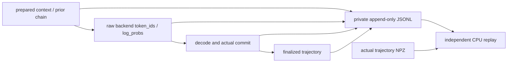

# R18 原生 Gateway token 证据

目标：补齐 R17 只有最终数组、无法独立核对每次 backend 输出与动作掩码的缺口。用户已授权完整训练验收；本变更不替代生成、奖励或 trainer 数据。

## API 与边界

- `UNI_AGENT_TOKEN_JOURNAL_DIR` 未设置则完全关闭；开启时使用绝对私有目录，session ID 的 SHA256 作为文件名；目录0700，文件0600，以 exclusive create 防混入前次运行。开启后的写失败明确报错，禁止假称有完整证据。
- `uni-agent.token-journal.v1` 每条含 session_id、递增seq、kind、request序号；prepare记录生成前数组、此前 committed chain、rollback边界、消息角色；backend记录未经文本重分词的实际 token_ids/log_probs、实际policy版本；commit仅在decode与commit成功后记录chain及数组；failure标识未成功请求；finalize绑定返回轨迹。
- 不写auth、headers、消息正文、环境变量；token本身属于敏感训练数据，仅保存私有云目录。公共报告仅哈希/计数/断言结果。
- 审计独立实现 append-only MiMo/Qwen CT：旧token保留、context/boundary新增mask/logprob=0，backend输出直接追加mask=1及原logprob；rollback从上一成功生成前的buffer和assistant-prefix推导，包含首次assistant对prompt尾缀的裁剪。denied首次rollback删除空前缀chain，后续rollback保留已验证prepared前缀；普通denied保留此前committed状态。拒绝其他token改写。失败请求不能更新committed chain。
- 最终与真实NPZ IDs/mask精确相等，logprob按实际float32落盘规范化后精确相等；检查finite、连续事件、session/chain、finalize、backend→commit及实际dump哈希。此证明数值传递，不声称重新前向计算模型logprob。
- 目录级flock累计512MiB/10,000事件上限，超限失败；JSON禁止NaN/Inf，float32规范化后再次检查finite。CLI允许重复`--session-id`按batch审计的实际消费集合筛选；未指定时明确为所有finalized dumps，不宣称都已消费。

## 文件

- 新增 `uni_agent/gateway/session/token_journal.py`：仅stdlib recorder。
- `uni_agent/gateway/session/session.py`：小型opt-in观测hooks。
- 新增 `deployment/checks/token_journal_audit.py`：CPU离线独立核验与CLI。
- 新增对应CPU测试；既有session多chain/budget/codec测试回归。

## 测试

云端CPU运行，Mac不加载模型：默认关闭、权限/exclusive文件、真实session hook成功/失败/rollback、两轮工具context、IDs/mask/logprob被改拒绝、漏backend/commit/finalize及错误chain/session拒绝、非finite拒绝；实际R18结束后对所有消费轨迹audit。fixture通过不等于实际R18通过。

## 2026-09-30 云端验证结果

- 既有session/budget/CT与新增hook回归：145 PASS；最终专项含CLI成功/失败：23 PASS；新增recorder+独立审计器225/228行，98.68% coverage。
- 独立CPU Ray实例、真实`GatewayActor.remote`、C3 MiMo tokenizer与两次HTTP请求：1 PASS；job runtime_env传播已验证，CUDA未初始化。backend为明确标记的synthetic preflight，不是训练样本。独立replay核对2个backend token、12个context token、7事件。
- 探针结束后`/proc`核对所属`/tmp/r18-tj-*`实例无残留进程。未修改固定273环境、原checkpoint或任何共享服务。
- 公共证据：`evidence/r18-token-journal/readiness.json`与三个PASS日志。早期collection及probe失败日志保留在云端并在readiness内绑定SHA。
- 测试注意：对包含Torch导入副作用的包使用dotted `--cov`会触发coverage源发现与`sys.modules`恢复冲突；本次用独立`coverage run`和文件include，未patch Torch。Ray probe中的pytest模块须显式在worker可导入路径内。
- 待R18：从真实batch选择实际消费session IDs，运行独立CLI，绑定journal/metadata/NPZ SHA；此项在训练前仍为未验证。
