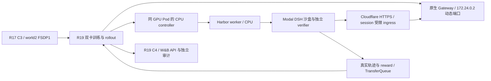

# R19 控制器同机部署与真实恢复验收

目标：从 R17 原始 C3 在新身份 R19 完成双 rank 原生恢复、真实 Harbor/Modal/DSH 轨迹、step4 有效 GRPO 更新、C4 和 W&B/token/checkpoint 对账。用户已授权本会话继续完整修复及加快打通。固定截止仍为 2026-09-30 07:11:09 UTC /15:11:09 SGT（1790752269），不随重试重计；GPU Pod 保留。

R18 实际失败：训练前控制连接失效，supervisor 健康检查连续18次失败，训练子进程被终止，operator exit1，无 fit/C4/journal/W&B。Runpod 只读控制面确认原控制宿主 `769tt1sxhn6bpj` 为 EXITED，训练宿主 `db7kewdkd71js6` 为 RUNNING。停止原控制宿主的发起者未知，不能推测为训练模式问题，也不复活另一实验的 GPU Pod。

## 部署与接口合同

- 保留原生产 Controller、RunSpec、SshTunnel、ModalIngress、worker 与认证接口；仅修改部署位置及 run 身份。
- 控制器与 worker 使用 GPU 宿主 CPU，CUDA_VISIBLE_DEVICES 为空；实际工具与 verifier 仍在 Modal，模型仍在双 GPU。
- SSH 严格连接同容器 `127.0.0.1:22`，临时 key 限源127.0.0.1、禁止shell/agent/X11/pty，精确 permitlisten 两个反向端口；permitopen 仅实际 Gateway host172.24.0.2 的动态端口。
- 私有 key/known_hosts：`/root/mimo-private/cohost-r19/{loopback-key,known_hosts}`。凭据不进入仓库，不修改原 authorized_keys 内容，仅增加标记明确的本轮条目并在退出时清理。
- 本地 control38860、worker38861、model38862、ingress38863；反向 control38760、worker38761。六端口全互异且启动前空闲。
- 原生 Gateway 发布地址必须实查仍为172.24.0.2，否则拒绝启动；不把它强改为localhost。
- Modal TOML、Cloudflare既有 named tunnel credential 与固定 cloudflared2026.9.3 在 GPU 私有目录安全部署；保持现有 hostname/TLS/auth。
- 保持273依赖、MiMo模型/data/DSH/SDK/image pin、32K/20480、LoRA、并发2、两TP1 replicas、C3 manifest SHA8046c24e335682ec67fdf71b1c3f1fc0dc05e016ee17246950858ef5f9001706、绝对step4/save1；不 fresh 回退。

## 文件变更

- `mimo_r19_preparation.py`、`mimo_r19_preflight.py`：R18准入合同派生，改为同机CPU prepare，绑定六端口/loopback key/实际Gateway地址/固定deadline与源码。
- `tests/uni_agent/deployment/test_mimo_r19_{preparation,preflight}.py`：新身份、同机路径、端口冲突、地址不匹配、manifest与deadline拒绝路径。
- `evidence/r19-*.json`：实际依赖/认证/HTTP/prepare/preflight、恢复/训练/参数/token/W&B、成本及回收证据。
- `tasks/verl-uni-agent-harbor-opd-rl/{handoff,lessons}.md`：失败原因、当前身份和可冷启动入口；保留其他会话改动。

## 验证顺序与完成门

1. 云端纯CPU增量回归；生产源保持固定，精确commit完整Ruff check/format后push/freeze。
2. 实际 loopback SSH、严格hostkey、Modal只读认证、二进制与凭据验证。
3. 使用生产 Controller/worker/Ingress 的真实HTTP预检：control注册认证/错误spec；worker错误token401、有效token不存在job404；公网模型路径 POST 随机nonce经38863→38862→SSH→实际HTTP上游，核counter与响应；finally回收并核六端口释放。Ingress自身nonce不经过模型转发，因此单独nonce不算此证明。合成上游明确不属于模型训练验收。
4. 实际同机prepare与CPU preflight，保存真实exit及SHA，然后启动独立R19 controller/driver/timeline与本机证据归档。
5. 原生两rank model/optimizer/RNG/scheduler重载，初始真实policy3；实际step4消费四个TQ key与真实DSH/verifier receipt。
6. 非恒定reward、正负advantage、有限非零梯度、C3→C4 LoRA/optimizer有效变化，base不变；实际消费session的journal→NPZ独立重放。
7. 原生W&B完整API history与原Ray console对账、Prom/Tempo本run事件、C4保存、所属资源回收、成本/失败/未覆盖、最终commit/push/handoff。完成前 goal 保持active，不宣称能力提升或在途队列精确恢复。
