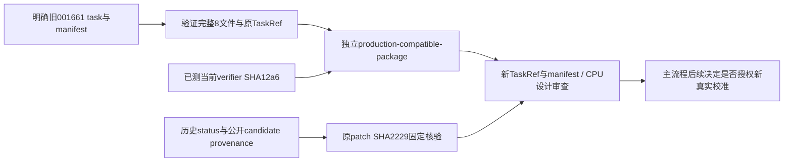

# R20 001661 fallback：仅 CPU 独立包准备

## 目标与边界

为初始已批准Code课程的001661锚点准备当前生产兼容包，作为002549轨迹奖励恒定时的后续候选。只读明确旧包、旧校准和原独立候选patch，不分配Modal、不创建新spec/controller、不占端口、不启动GPU。固定训练窗口仍截止1790759992；不修改当前R20e运行、任何freeze或原包。

## 输入与合同

- 历史校准明确文件：`/workspace/mimo-dsh-rl-20260928/verifier-calibration-r2/status.json`，SHA `4e4f3832b73dfb2abce4d490ea419cc6e1274ab4a1348964f70ef13bb7d9e10f`；历史实际奖励0/0/1。
- 旧task：`/root/mimo-private/task-001661-r19/task`。核全部regular文件、旧manifest与原TaskRef，拒绝symlink/附加文件。
- 候选路径由已跟踪公开provenance明确给出：`/workspace/mimo-dsh-rl-20260928/public-only-candidate-001661.patch`，SHA `2229cbd226fa8f2add77b39247ecea70832cdcb748f60239f70e60162d1dfdbc`。旧status顶层记录同SHA，但其`source_hashes`只有row/calibrator/verifier/helper四项，没有候选路径；不得宣称从不存在的字段取得路径。
- 候选只作独立verifier positive control，绝不作为student rollout、训练演示或奖励调整来源。不读取隐藏test输出修改它。
- 当前trusted verifier从`run-src-r20/examples/mimo_dsh_rl/verifier.py`读取，SHA `12a6f9d3a849ff66168269f800f63325077d76a61942e9315d8335eb6d63c371`；runtime提交1ccc、manifest99ac不变。
- 新独立路径：`/root/mimo-private/r20-data-audit/format-code-task-001661/production-compatible-package/`。保留原8文件，仅将`task/tests/verifier.py`替换为当前已测blob。instruction、hidden test patch、images、DSH binding、test command和工作目录全部保持字节一致。
- 新TaskRef按既有`prepare_tasks`/executor合同对相对task路径→裸SHA map做canonical JSON hash；manifest重新绑定新路径与文件SHA。sidecar明确prepared-only/current runtime/pending calibration。

## 文件与验证

只新增本设计与公共CPU准备审查JSON；云端私有独立包不拷贝到Mac。没有生产helper/core改动。

CPU验证旧包全部SHA和原digest，再验证新包除verifier之外完全相同、新digest与manifest一致、当前verifier可编译、candidate SHA一致、旧包与候选前后未变。既有生产兼容回归已覆盖当前verifier；本次没有重新运行原镜像CLI。新包必须重新通过当前无shim真实校准及父checkpoint机制/原生preflight，才能成为后续stage，不能把旧校准直接宣称成新包校准。

## 实际 CPU 审查结果

2026-09-30上述CPU检查已通过。原候选1932bytes、SHA2229固定不变，可以复用作独立positive control。旧包manifest SHA `54264e2e32620fc04bb54c158efbdfb485fc58bfe34c31cdfb3a86b3bbfb0a02`及全部8文件前后不变；新包只有`tests/verifier.py`不同，当前12a6blob编译通过，其余7文件及镜像/DSH/testpatch/instruction原字节保留。

- 新manifest SHA：`3a3ee236835d707d8d5604d29b26f59a2adc65ff84440ec59f2c05aa8906a416`。
- 新TaskRef：`mimo-code-format-code-task-001661` / `v1` / `sha256:1cbe58ecc0884511c8804aa93557767fc2fd7983ddba670ee99b073ad9280435`。
- 公共准备报告：`evidence/r20-001661-fallback-package-preparation-20260930.json`，SHA `3c609fe61c4b10ae6bf9a7cceaa2f655324f0144791555e2651d93957f68bf63`。

本次Modal资源0、未创建spec/controller、未占端口、未启动GPU。新包校准门明确为false，后续真实无shim校准尚未授权或执行；不得以这个CPU检查代替奖励正确性和有效训练更新验收。
