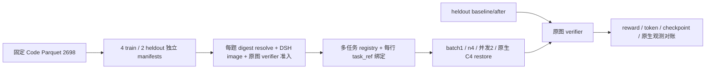

# R20 Code 多任务抽样设计

## 直接执行

本窗口只承诺顺序课程4train=001661锚点+3新题；2heldout只冻结候选，不承诺能力评测。

本方案固定 MiMo Code revision `639865fd3374018d6cb29b9fb82dd531406fcf5f`，建议 **4 train + 2 heldout**，复用双卡原生链路、DSH/sdk-minimal、32K窗口和独立原图 verifier。固定截止 `1790759992`（2026-09-30 09:19:52 UTC / 17:19:52 SGT）覆盖准备、训练、评估、回收。当前只完成云 CPU 数据盘点与候选设计。

### 实物盘点

- Code Parquet 实读2698行，现有全量格式审计已通过；源码锁`e15733cf2451cfbc5492a4120f7f8cfddbad818aa9f0b324c79888dd1fece161`，本轮没有重复大文件hash。
-2698个task都映射到同一Docker Hub仓库，但**2698个tag全不同、每个只出现一次**。001661的已验证派生镜像不能直接用于另外五题。
- 源测试包装命令1903条单/testbed、519条单/workspace/repo、276条base&&new；843题带encoded build env。按测试补丁扩展名推断Python1152/Go722/JS-TS550/JVM31/C-C++20/Other223，这只是语言启发式。
- 可筛出686题Python、小于14KB补丁、无embedded env、单包装命令。固定README有code/cyber/general/webdev/music；其他domain必须各自适配harness，不能自动复用Code scorer。

### 可审阅抽样清单

| split | task / source row | 推断仓库族 | 定向测试 | 镜像准入 |
|---|---|---|---|---|
| train | `format-code-task-001661` / 7 | Django friendship | `exec /usr/local/bin/python -m pytest /workspace/repo/usercase-test-coderl/test_bidirectional_friendship.py -v` | 已有真实001661验证 |
| train | `format-code-task-002549` / 243 | Python Result error handling | `PYTHONPATH=src python -m pytest tests/test_result.py -k unwrap_or_raise -v` | 原图digest/派生DSH/verifier待验证 |
| train | `format-code-task-002857` / 510 | SQLGlot SQL parser | `python -m unittest tests.dialects.test_mysql.TestMySQL.test_unsigned_int_types -v` | 原图digest/派生DSH/verifier待验证 |
| train | `format-code-task-000466` / 1396 | pyupgrade source transformation | `python -m pytest tests/typing_typed_dict_test.py tests/typing_named_tuple_test.py -v` | 原图digest/派生DSH/verifier待验证 |
| heldout | `format-code-task-000164` / 1740 | duckdb_engine SQLAlchemy adapter | `python -m pytest duckdb_engine/tests/test_datatypes.py::test_uuid_roundtrip -v` | 原图digest/派生DSH/verifier待验证 |
| heldout | `format-code-task-002374` / 2166 | Pydantic data validation | `python -m pytest tests/test_main.py -k "frozen_model_delattr or frozen_field_delattr or frozen_model_delattr_hash_preserved or non_frozen_delattr_still_works" -v` | 原图digest/派生DSH/verifier待验证 |

每题 source row hash、prompt hash、test patch SHA、source tag、mapping target、原始测试命令、timeout1800s和patch路径均在 [inventory](evidence/r20-dataset-inventory.json) 中。001661是已经训练过的锚点，单独标注；真正heldout是002374/000164，禁止训练或预取消费。仓库族来自公开源问题和测试路径；在原图中核git remote/base tree后才可声称仓库隔离。

### 架构与文件变更边界

设计类交付仅为此文档与inventory JSON。后续实现需显式修当前单题prepare_training/task_refs绑定，让每行所选task_ref可在HTTP/controller/worker/postprocessor审计链里追溯；具体源码文件由实施方案决定。本盘点未更改运行源码。

### 四小时执行规模

建议保持`train_batch_size=1`、`rollout.n=4`、双并发，4次有效更新分别覆盖4个train task，目标16条训练消费轨迹/C4→绝对C8（heldout候选只冻结）。固定种子、无放回顺序；不要把batch扩大到4而让每步膨胀16条轨迹。旧C4`data.pt`来自单行数据，必须验证新4题dataloader状态，禁止静默跳题或仍只训练001661。

预算建议：镜像/评分准入60分钟；原生恢复/预检20；4次顺序训练更新130；审计归档回收30，共240分钟。它是规划估计，不是完成保证。任一准入失败先保留失败原因，最多在686候选中换同族备用；不能为了凑数执行未校准题。若准备消耗过多，优先完整4题一轮+heldout对比，停止扩展到8题。

验收至少包括：六题manifest/source来源绑定、每题真实原图与派生图digest、baseline/public-only candidate评分校准、四个distinct训练任务有消费记录、heldout零训练泄漏、实际原生更新/参数delta、两题前后verifier结果、所属资源结束和共享Pod保留。

## 深度交互

“小数据集”应先定义为能真实运行、能产生可信reward且与heldout隔离的任务集合。原始Code库的大部分准备成本在任务镜像与评分器，不在Parquet抽样；同一镜像仓库也不意味着同一运行环境。当前只有001661通过真实准入，另五题仍是候选。

4+2的目的应是验证多任务采样/训练/独立评估链路，而不是从4h和2个heldout题推导普遍能力提升。若用户想覆盖五domain，该要求比Code内多子集更大，需要另立harness与不同verifier合同；应先完成当前Code pilot，再按明确目标选择域，避免把新域发现当成训练验收。

### 本窗口范围修订

按最终推进范围，本窗口采用顺序课程4train=001661锚点+3新题；两题heldout只冻结候选，不承诺本窗口能力评测。预算修订为CPU准入60分钟、原生恢复预检20、四次顺序更新130、最终审计回收30，共240分钟；固定deadline不重计。原图registry三新题已真实resolve，派生DSH与verifier仍须实际准入。

### 实际镜像交付与操作偏差

3新task各自派生DSH镜像已真实build/push/private/readback/keyless smoke通过，72–88秒/题，immutable-task与spec binding草案已就绪；任务reward校准仍待完成。3个所属builder sandbox均经独立Modal API poll returncode137验证结束，不重复build。原图digest及派生图digest见inventory和r20-task-images-build-final.json。

实际builder峰值并发3，超过要求2：两个线程共用报告tmp文件，atomic replace竞态使一个线程在等待所属child前异常释放槽位。原失败日志保留；私有operator已改用写入锁与唯一tmp路径，并在finally等待child，不改任何训练/runtime源码。全部构建已结束，未发送额外kill或操作共享服务。
