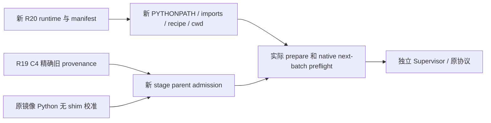

# R20 顺序课程 operator：云 CPU 验证与后续版本边界

## 已完成的真实验证

2026-09-30，冻结 R19 core `4dbd87ad4f6123f99a1f715a6637322a44cff6a5` 下的薄 operator 完成72项云 CPU 回归，零失败、错误与跳过。相同 operator 文件（SHA `8252c9f6dbaf1f8f4505b7c2fef84556ec8f5d28bdccc8946b393acea14c11d4`）再执行实际 R20a prepare/preflight；合并覆盖260/277行，即93.8628158845%，无排除行。Mac没有执行测试、模型加载或训练。

实际 preflight 在06:16:35 UTC完成，保存真实273依赖核验、冻结 import 来源、原生 Hydra world2/FSDP1/colocate_async配置和 C4→绝对 step5 恢复参数。实际准备的001661单行 Parquet经过原生 StatefulDataLoader/PPO fetch，返回本阶段真实 prompt/data_source/new-run UID；父 data.pt 前后不变，CUDA未初始化、未加载模型。

R20a只作 CPU 回归。001661奖励校准明确复用同一冻结任务、镜像、测试文件的历史证据，不声称重新执行校准。实际数据 fetch 也不等于 GPU 训练消费或有效参数更新。本报告不授予新任务 GPU 启动许可。

证据：

- `evidence/r20-operator-actual-cloud-validation-20260930.json`：SHA `6f7fe58267b78c182b20a18f09efe6eb192bb5f8f5c995ff45c9e7fc76c2a91a`，实际输入、源代码、parent seal、HTTP证明、prepare/preflight与测试产物哈希。
- `evidence/r20-operator-combined-coverage-20260930.json`：SHA `b5489172e04b005a4591d59649032606c745c3a78603f541b7126ed624ace0b6`，完整逐行覆盖记录。
- 云端实际 preflight：`/workspace/mimo-dsh-rl-20260928/integration-check/r20a-actual-preflight.json`，SHA `f10fa56f717d1985724e82774ceb7c5a60cb5f773f9be47f9e7e13940d131492`。

较早 `r20-operator-cloud-tests-20260930.json` 是66项测试的历史中间产物；最终门以这里的72项和实际执行组合覆盖为准。不得用 coverage 显示值四舍五入替代精确80%门限。

## 新 R20 source 的最小变更设计

新任务原镜像 Python 兼容修复另有 `r20-original-python-compat-design.md`。新 runtime 必须使用真实提交与独立 manifest，保留 R19的1003文件和当前 CPU bundle 原字节。待实际 commit/manifest/count 提供后再锁定新 operator；不预造 SHA。

新版本需要同时变更这些绑定：source commit、manifest路径与SHA、文件数量、source目录、recipe、preflight Hydra根、Supervisor cwd、CPU runner实际 import来源。继续使用已验证 overlay/NCCL，但不能将R19 helper返回的旧 PYTHONPATH直接当成新runtime环境；先验证旧路径的确切结构，再以同overlay和新freeze路径构造环境。新freeze中的native IPC/PPO/dataset源码必须与对应manifest和已实证原生文件SHA一致。

父来源仅特许精确已封存的R19 C4：manifest SHA `40f25db06843bc9400f7f4fbe82eea46e7dcae8fffa9c5d383cf1ded40bb1270`、run `mimo9b-001661-r19`、task `001661`、checkpoint `runs/r19/rl-training/checkpoints/global_step_4`、旧source `4dbd87ad…`。这不是对任意旧source checkpoint的许可。后续parent必须属于新runtime，并绑定实际原生更新与W&B验收证据。

新任务准入另外绑定实际当前 runtime commit、workspace helper SHA、打包 trusted verifier SHA和原Python无shim执行证明；task digest本身不覆盖运行时注入helper，不能代替此门。002857/000466候选校准失败仍未通过，002549旧私有shim校准也不能冒充新生产兼容证明。

跨任务机制探针须绑定本次实际parent checkpoint/step/data SHA；C5以后重新执行，不把C4合成探针复用为新parent结果。实际prepare后的Parquet探针还须校验PPO/utils/dataset真实 `__file__` 位于新freeze，并匹配manifest。外部TorchData来自冻结273环境，来源单独记录。

固定截止1790759992、清理预留180秒不变。新GPU阶段起跑前要求至少2400秒余窗，不能因为helper旧版本只允许600秒而绕过预算门。新增故障测试覆盖错source/import、泛旧parent、新parent误用C4机制证明、shim证明与不足余窗；全部云CPU完成后再冻结新独立bundle。

## 当前 R20e 新任务实际 CPU 验证：PASS

2026-09-30，当前新runtime已完成真实002549任务的prepare、preflight与无shim校准准入。实际恢复R19 C4的原生loader state后，新任务单行Parquet返回真实instruction、`harbor/mimo-code-format-code-task-002549/train` 和新run UID；父state与Parquet前后SHA不变。原生PPO/utils/dataset来源均为新freeze，TorchData来源为冻结273环境，未加载模型、未初始化CUDA。这里确认数据准备与恢复路径，不声称已消费训练batch、更新优化器或完成W&B训练验收。

实际source是兼容提交`1ccc1640c0f34ba5f515d3613fac6a278bd38f4c`及manifest `99ac03f55d4eaeebc63d2ba466452fef2af7a51af289fc135d5051dadca0591f`，1003文件。组装方式明确为`verified-r19-runtime-plus-two-git-blobs`：逐文件验证R19基底，仅替换workspace helper和verifier两个精确Git blob。没有宣称1003文件均来自该Git tree；也没有改R19原目录、模型、DSH版本、原任务镜像或共享环境。

实际当前adapter绑定原始spec `55cca9bd…38ae`、新任务包`84430b7c…5030`、无shim公开校准`9fd8ad8f…4b92`与真实原始报告`50a9f9f2…c2a6`。原镜像Python3.10.18直接运行打包`tests/test.sh`和verifier，baseline-direct/baseline-restored/candidate-restored实际奖励0/0/1、退出码1/1/0；三处独立终止回执均已确认。当前DSH测量指纹与RunSpec的SDK/runtime artifact pins分别核验，避免将不同namespace的hash错当同一合同。002857与000466的实际失败校准仍未放行。

同一当前文件的云CPU测试为99项operator故障/原生恢复测试及18项adapter字节/receipt绑定测试，全部通过。前者选取v3报告内最终operator的99项；后者来自最终adapter的独立v4报告，不把v3中的旧adapter结果算到新版本。覆盖率按每个当前文件分别过滤同字节执行数据，没有排除行：

| 当前文件 | 精确SHA | 覆盖 |
| --- | --- | --- |
| `mimo_r20_operator.py` | `1dc5a32017f46173088a658d4536a4af356bd0ada170987d28897e16f78f41ac` | 316/333，94.8949% |
| `mimo_r20_calibration_admission.py` | `6e70997e9270fd8298a63a190996350702c61f00f8c2760fe79484f389771b19` | 106/115，92.1739% |
| `mimo_r20_cpu_prepare.py` | `370fb362eb319f1227e3e46d6a4d8e8e8f3927910c66e00ce2ed6a91d77c35e4` | 36/41，87.8049% |

合计458/489行，93.6605%；每个文件分别通过80%门。当前bundle仅冻结5个已测试helper/test文件，不重新冻结1003文件。主要公共证据：

- `evidence/r20-runtime-current-tests-20260930.json`，SHA `bd380104c9dfc37dab327c4ce6a58d078c3a2a07162fe823c851bbc1975ccfe1`。
- `evidence/r20-current-coverage-validation.json`，SHA `f50142f19b2a8881702dad64f28899f71b885893540cc664f5e4ee400a92805f`；逐行记录见`r20-current-combined-coverage.json`。
- `evidence/r20e-actual-prepare.json`，SHA `ab4de11152cc1c2aefab0db84d81ce74f615f95a6ee4668de58b50dffaca1ad5`。
- `evidence/r20e-actual-preflight.json`，SHA `49d081a1e2b8f7b2d3fab11593caaf538bde56b2ca845c5d3de2d6b1aff12b08`，绑定实际273依赖、冻结import、recipe/world2/colocate_async、绝对step5及实际新任务。
- `evidence/r20e-production-calibration-admission.json`，SHA `28f77e026c5c6fee396733669f3354df3ecf50ff2712bc05383e3166835c9cfa`。
- `evidence/r20-current-tested-bundle-manifest.json`，SHA `dbfe88642bd9c4aa5b618ab865a0967302cf22918d8d8d3fdc8a75eebb83e685`。
- `evidence/r20-current-actual-cloud-validation.json`，SHA `7e600e6f9b816e4043ebbf1446e63bb8e54101b11143d1e6a70d6065ef9b9ca6`。

实际新stage CPU plan原字节保留；Supervisor使用独立plan添加已验收preflight路径与SHA。原HTTP证明明确是R20a历史实际探针，仅在传输模块字节相同的组装前提下复用；本报告不将它重新命名为R20e探针。下一道门是最终代码review/commit/push后的双卡GPU执行，以及真实native checkpoint和W&B API验收。
