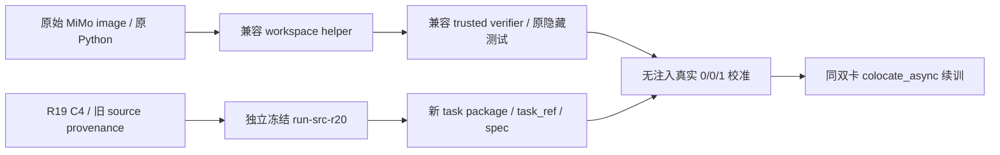

# R20：原任务 Python 兼容修复

## 真实故障与目标

新任务原始镜像使用较旧 Python。生产独立 verifier 的 workspace helper 固定由原镜像 `python3` 执行，`hashlib.file_digest` 需要 Python 3.11；verifier 的 `isinstance(timeout, int | float)` 在 Python 3.10 以下失败。私有校准兼容注入得到的 002549 奖励 0/0/1 不能证明未经注入的生产路径可运行。002857、000466 的独立候选均实际得0，仍保留未通过，不能虚增任务覆盖。

目标：以最小 stdlib 修复让生产工具支持实际原镜像 Python（支持下限3.8），保持任务测试环境、隐藏 patch、奖励定义、文件与权限预算不变。原 MiMo 镜像和 DSH release 不重建、不更换全局 Python、不改模型或 GPU 模式。

## 路径与隔离

R19 runtime/manifest/任务包保持原字节，不原地修改。提交经过测试的兼容代码后，生成独立 R20 runtime/manifest，记录真实 commit。新 verifier 文件改变任务树 SHA，因此生成新的 task package、task_ref、spec/stage；旧未启动 spec 和失败校准保留。C4 parent 原来来自4dbd87a，准入显式允许该已验收父版本，不把旧 checkpoint 伪称新源码产物。

冻结产物的实际组装合同：R19 的1003文件清单含已固定的 VERL 目录与生成文件，不是当前 Git 的完整树。R20 逐字节核对并复制该已验收 base，再应用兼容 commit `1ccc1640c0f34ba5f515d3613fac6a278bd38f4c` 的两个精确 Git blob。新 manifest 明确记录 base commit/SHA、兼容 commit/两个 blob SHA、实际组装模式及1003文件 SHA；不得称全部文件来自新 commit 的完整 checkout，也不重新拉取或升级 VERL。

## 文件与合同

- `uni_agent/tasks/harbor_dsh/mimo_workspace.py`：用流式 SHA256 支持旧 Python，核路径 API 的实际最低版本。保持 digest、归档字节、安全校验与 max_files/max_bytes 含义。
- `examples/mimo_dsh_rl/verifier.py`：运行时类型判断使用 `(int, float)`，保持 bool/非正 timeout 拒绝，以及测试失败得0、基础设施失败无 reward 的区分。
- 两文件对应现有测试：回归旧 Python 能力、workspace snapshot/restore、边界拒绝和 verifier 错误分类。
- `mimo_r20_operator.py`：将实际运行源码路径/commit/manifest绑定到新独立 freeze，明确批准的旧 checkpoint parent 来源，实际 import 来源与 shell PYTHONPATH 一致；协议本身不变。
- 新 task package 与 admission/prepare/preflight/训练证据：绑定修改后的 trusted verifier SHA、原数据 revision、原 image 和 DSH digest、真实原生校准；不沿用旧 task_ref。

## 验证与预算

1. 云 CPU 现有回归 + 有意义兼容测试；新代码覆盖率至少80%，不以四舍五入或未采集执行代替测量。
2. 用实际原镜像 Python 运行新 helper/新 verifier，不使用私有 shim；逐项保存 Python 版本、实际文件SHA、baseline direct/restored 和独立公开候选的真实 reward/receipt。
3. 固定四小时截止1790759992（17:19:52 SGT），新阶段余窗至少2400秒、清理预留180秒；不可为此重计窗口。
4. 精确 commit + 全仓 Ruff check/format + push + frozen manifest后，实际 prepare/preflight。只有真实生产兼容校准通过才启动GPU。
5. 原生 C4 恢复、真实轨迹消费与有效参数更新、完整checkpoint、原生W&B/Insight与所属资源清理分别验收。五领域未完成的状态仍然成立。
