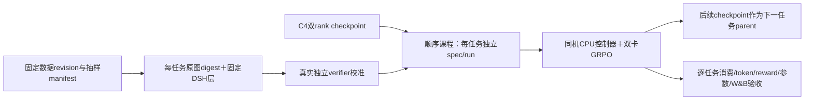

# R20：四小时 MiMo Code 小数据集续训设计

## 目标与授权

从已验收 R19 C4 继续，同双卡 RTX PRO 6000、world2/FSDP1、colocate_async、固定模型/数据 revision、DSH b236969/SDK-runtime0.1.3a2，完成多个真实 Code 任务的有界训练与证据归档。窗口从本次请求核定时间 2026-09-30 05:19:52 UTC 起算，固定截止 09:19:52 UTC /17:19:52 SGT（1790759992）；包括准备、冷启动、训练和验收，保留至少180秒清理。到期不重启新GPU工作，Pod保留。

GPU上次确认单Pod两卡费率$4.18/h，四小时GPU分配估算$16.72，另有Modal/磁盘/传输费用，非全成本承诺。Mac只编辑/Git/轻量回读；CPU镜像构建/数据处理/测试和GPU工作均云端。

## 数据范围与已发现限制

默认沿此前已验收的Code范围准备，待用户子集偏好回复时调整。固定数据revision639865fd3374018d6cb29b9fb82dd531406fcf5f。Code2698真实任务中按不同测试命令/工作目录族抽样，优先选择4个训练任务、2个独立评测候选；冻结真实source row/hash、prompt、test patch、原镜像及独立verifier，不能把001661复制成多任务。

每个Code row有唯一任务镜像。当前单一RequestPolicy只绑定一个DSH release，prepare/worker/postprocessor固定一个task_ref/task_dir。仅增加Parquet行无法构成真实多任务训练。

预算复核后的实际训练优先级：001661 已有 R19 C4 完整验收，本轮只用于 CPU admission/prepare/preflight 回归，不重复花费一个 GPU 冷启动周期。优先从 C4 直接续训新任务 002857 → 002549 → 000466，每个任务一次原生更新并保存下一 parent；本轮新增训练样本范围是三项，历史 anchor 与本轮新增结果分开报告。若实际校准失败或余窗少于2400秒则不启动该阶段，不用重复旧任务凑覆盖。

## 架构与短路径

先评审顺序课程方案：每个任务独立run/spec/image，模型和optimizer连续原生恢复。复用原生产协议与完整安全校验，明确记录多run课程，不声称同一run混合采样。只有在review确认恢复data loader状态及绝对step语义兼容之后采用；禁止跳过恢复门禁或在失败时fresh回退。

跨Code/Cyber/General/Webdev/Music领域需要各自harness及verifier，不将本轮Code抽样称为五领域复现。若用户选择跨领域，先调整设计和验收范围，不能以统一0/1评分伪装兼容。

## 文件改动与API合同

- 本设计及r20-data-selection-design/inventory：数据选择与实际环境可用性。
- 待review后增加独立r20 operator/preflight/helper及有意义回归，不修改冻结run-src-r19或共享环境。
- 必要的新recipe只配置数据、独立run身份、C4parent、训练目标步、deadline和观测；同world2/native恢复。
- 原任务RequestPolicy、task_ref、DSH release、worker权限与receipt准入合同保持；每个task有自己冻结spec。新增课程manifest记录所有stage、真实消费与完成状态。

## 测试与完成门

- 云CPU验证：来源/不重复/训练评测隔离、任务树/image/release绑定、parent manifest完整、绝对deadline/step、不覆盖已有run、实际prepare→launch→Hydra参数。
- 每任务启动前核真实镜像与Harbor separate verifier可用性；校准只作环境前置，不计训练reward。
- 原生两rank恢复日志＋实际policy版本＋真实TQ消费，保留budget terminal和取消预取；四条同组奖励差异、非零advantage/梯度、真实LoRA/optimizer变化才记有效更新。
- 每stage保存完整checkpoint/数据状态；W&B用对应独立run原生history对账，RL-Insight保留真实metrics/traces，禁止回填。
- 任一任务环境失败只记录并按预先定义替补策略替换；训练阶段全零组不记有效学习。数据集“完成”必须覆盖全部冻结训练任务的真实消费，不以下载/转换完成代替。
- 窗口不足时先保全当前checkpoint并所属清理，按manifest报告已完成/未完成任务；不为了宣称完成削减证据或重算四小时。

## 当前准备状态

已只读确认C4两rank模型、optimizer、extra_state在，05:18UTC两GPU0MiB/无compute process。数据抽样与最小课程恢复review进行中；尚未启动本轮GPU训练。

## 顺序课程数据状态边界（CPU 实物探针）

新增独立 `mimo_curriculum_data_probe.py` 与对应测试，不改变训练运行源码。读取原 C4 的1499字节 `data.pt`，固定SHA `58f16b6036f8994e9b19abde895b0a7969dbba54365747f210e577ebd0368d37`；核 FSDP1/world2、没有 `transfer_queue` 目录且原件前后SHA一致。只允许已观测到的 sequential 单行状态（dataset_state/fetcher_state皆null、samples_yielded1），不推广到随机、多行或多worker loader。

用真实 MiMo tokenizer、原生 RLHFDataset/StatefulDataLoader 和原生 `PPOTrainer._fetch_one_gen_batch`，把原 C4 loader 状态加载进全新的单行 Parquet；验证耗尽游标经原生 StopIteration 分支重建 iterator 后确实返回新 prompt/data_source。新行是显式标注的合成机制探针，不能充当实际新任务消费证明。原生 UID 会重新生成，因此任务身份以 prompt/data_source/独立 stage spec 校验，不要求旧 UID 连续。测试覆盖耗尽恢复、新任务内容、内嵌旧 dataset state、异构游标以及不可达绝对目标步。

现有 `launch.finalize_training_plan` 已根据绝对目标步设置 total_epochs；单行 C4→C5 对应 initial_epoch4、total_epochs5、第一训练步5，不需修改 trainer。课程转换保留 loader 游标恢复，同时明确切换 dataset；不会宣称完整 bitwise 数据重放。若以后父 checkpoint 存在 TQ 状态或 loader 形态变化，则拒绝本短路径，重新评审显式数据状态重置，不删除原 checkpoint 的任何文件。

实际结果：云CPU15项回归通过，探针文件combined branch coverage81.75%（无排除行）。真实C4 `data.pt` 恢复到新单行dataset后，原生fetch返回新prompt/data_source；CUDA未初始化、未加载模型、父data前后SHA相同。证据见 `evidence/r20-c4-data-resume-probe-20260930.json` 和 `evidence/r20-data-resume-validation-20260930.json`。这支持采用课程短路径，但每个真实stage仍需在实际prepare之后用其真实Parquet重做CPU next-batch身份核验，不能把合成探针算作新任务消费。
