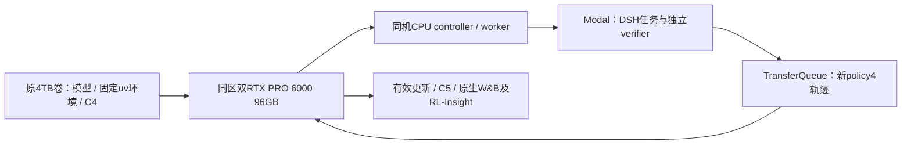

# 充值后恢复方案（2026-10-01 SGT）

## 已批准实施：双卡六小时（更新）

用户明确“好的 买双卡 跑6小时”，并要求完整真实闭环验收；覆盖下方原四小时提案。新建owned Pod `vo6u0t8x398bnm`，实际价格$4.18/h、2×RTX PRO 6000 96GB、原卷72jdno5cuk，同区EUR-IS-1。

固定allocation1790791473=2026-09-30 18:04:33UTC，截止1790813073=2026-10-01 00:04:33UTC/08:04:33SGT，21600秒，清理预留180秒；重启不重计。成本守护器只可停止该Pod，不能操作用户新A100或其他会话机器；网络卷保留。六小时GPU约$25.08，不含账户其他资源/存储/Modal。

新SSH157.157.221.30:51913；实际gateway172.25.0.2、driver595.91.07、CUDA主机支持13.2。固定uv环境metadata实查Python3.12.3/Torch2.11/vLLM0.23/Transformers5.8/Ray2.54.1/Modal1.5.5/W&B0.30，不重新安装。新host真实双GPU IPC四用例exit0，不代替9B原生恢复。

发现MFS忽略chmod：network路径仍0777。已撤销private symlink，/root/mimo-private恢复真实root-owned0700，凭据0600且从未写入网络明文；持久私有恢复包采用AES-256-GCM，专用备份key仅Mac私有目录与当前Pod本地保存，不随密文归档。旧错误方案保留为发现记录，不继续采用。

新增实施文件：mimo_r21_cost_guard.py及对应云CPU17tests（96.67%覆盖）；mimo_r21_private_backup.py用于本轮加密备份。operator/transport使用显式SHA绑定的新授权、新hostkey和新base spec，冻结训练runtime99ac及273依赖不改。

以下为历史恢复调查及原始提案；预算/截止和权限以后续本节为准，当前训练仍待真正prepare/preflight与原生启动。

## 目标与范围

从已验收的 R19 C4 继续 Code 002549 的一次有效 GRPO 更新至 C5，保持固定 MiMo 9B、DSH、Harbor/Modal、双卡 colocate_async。先完成这一个恢复验收，再讨论其他 Code 任务及其他四领域；不升级模型或重装现有依赖。

## 实际恢复基础

- Runpod CLI 查询余额约 $2,996.29；原 Pod db7kewdkd71js6 查询404，旧11403连接不可用。
- 原4TB网络卷72jdno5cuk仍在EUR-IS-1。用户在调查过程中创建的单卡A100 Pod owb1q1vidflfhp挂此卷；本会话未创建它，其用途已询问，未操作其服务/GPU。
- 新只读连接157.157.221.29:12096：A100-SXM4-80GB，81920MiB，0MiB/0%。
- R19/R20源码各1003文件存在及大小匹配；manifest SHA为04fb0fcd…946564af、99ac03f5…ca0591f。没有声称本轮已全量重算源码内容SHA。
- C4的15文件共19,151,369,958字节，与40f25db0…bb1270清单大小匹配；FSDP1/world2、latest=4。未重读19GB张量；下一阶段完整SHA及原生恢复仍必需。C5目录不存在。
- 原uv环境纯Python3.12.3可启动，prefix正确；273依赖freeze SHA e9f87349…4dc7、CuPy清单、最终r20-operator-runtime五文件SHA匹配。未导入Torch/vLLM，未验证新主机GPU运行兼容性。
- 原/root/mimo-private已不存在；指定备份候选未发现。旧任务包、校准raw、spec/plan、凭据、journal原路径缺失；公开摘要不能代替这些实物。

## 架构

同一个训练Pod的CPU承载控制器；不另租专用控制器，不在Mac加载模型。原单卡A100不改变world2目标，不停止或替换用途未确认的机器。

## 硬件与成本

17:31:27UTC附近的Runpod实时查询：SECURE/POD/count=2/minCudaVersion=13.0/country=IS，RTX PRO 6000 96GB在EUR-IS-1库存LOW，返回主机CUDA13.2。目录价格$2.09/卡小时，双卡GPU估算$4.18/小时；4小时GPU约$16.72，另计磁盘/CPU附加价格、Modal及账户其他资源。库存LOW不等于已经分配成功，创建前重新核价/归属及实际总价。

推荐先批准最长4小时的恢复窗口；首次付费创建/开始云端校准时记录绝对起点，controller/supervisor/transport/preflight共享唯一截止，180秒清理预留，不因重启重新计时。Pod是否停止计费须明确约定；停止训练不会自动停止Pod。优先先恢复CPU前置材料再申请双卡，减少空租。

## 拟修改文件与API合同

- docs/本worktree/mimo_r20_operator.py、mimo_r20_transport.py：移除旧1790759992的本轮截止绑定，显式绑定批准的新窗口；到期、缺窗口、不一致、超上限均拒绝。只调整恢复控制层，不改已冻结训练源码。
- 对应operator/transport测试：覆盖旧窗口拒绝、新窗口一致性、启动/清理预留、不重计、不同主机SSH身份。
- 新身份暂用r20f；新run/spec/数据文件/journal/W&B ID，不复用crashed r20e，也不回填旧history。
- 云端私有配置按明确凭据来源重建，权限0600，绝不进入Git。持久恢复包分别保存非敏感材料及受保护凭据；公开报告只放SHA/版本。
- 002549从固定数据rev639865fd与固定派生镜像重新建立真实task包、task_ref和独立baseline/restored/candidate校准。原Python生产CLI无shim；不放宽准入以迎合摘要。
- 新主机loopback SSH gateway/host key实测，严格scoped授权，实际HTTPS完整model-path nonce检查；不复用旧主机授权指纹。

## 验证和执行顺序

1. 确认单卡Pod用途与恢复窗口；只读核账户总支出，保留其他会话工作。
2. 在允许使用的云CPU上重建缺失私有材料、真正校准task，核所属Modal残留；完整验证源码/C4 SHA，保留原C4不改。
3. 云端有针对性的operator/transport回归、当前API实测；精确commit通过全仓Ruff双门并push。新控制层另冻结，训练runtime仍99ac清单。
4. 分配同区双卡挂原卷，核实际型号/驱动/两卡空闲/现有uv环境GPU兼容性；CPU实际prepare/preflight和完整生产HTTP检查通过后才启动。
5. 后台同机controller+双rank训练：原生加载model/optimizer/RNG/scheduler，policy4四条实际消费、独立reward、正负advantage、有限非零梯度、参数变化、optimizer4→5、原生C5。
6. 原生W&B API真实step5及console对账，token合同和当前scope RL-Insight；只回收本轮进程/Modal/SSH授权项，记录Pod计费终态及交接。

## 完成门

CPU启动、GPU利用率或历史C4报告均不等于恢复成功。只有本轮真实更新、完整C5和原生W&B/Insight对账才能宣布续训通过。五领域复刻及能力提升仍未完成。
