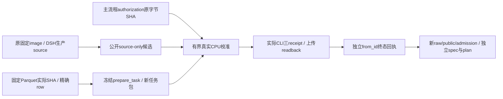

# R21 002549任务与校准恢复

用户已批准新owned双卡Pod和固定6h窗口。训练runtime、模型、DSH和273依赖保持原版本；本子任务只做云CPU恢复、真实校准及私有spec/plan，不启动GPU。

## 来源与合同

- 窗口：起点1790791473，截止1790813073，21600秒，清理预留180秒。必须读取主流程SHA绑定的`mimo.recovery-authorization.v1`，不自行复制或重计截止。
- 新主机：Pod `vo6u0t8x398bnm`，双RTX PRO6000；SSH `157.157.221.30:51913`。共享网络卷72jdno5cuk。
- 数据：`BASE/source/code.parquet`，固定revision `639865fd3374018d6cb29b9fb82dd531406fcf5f`，SHA `e15733cf2451cfbc5492a4120f7f8cfddbad818aa9f0b324c79888dd1fece161`。精确002549规范row SHA `ec5abcb5567240983c489dc90be4fd50260efc0a1e9916e0d0dfd7177037ab0a`。
- 包生成直接使用冻结`run-src-r20/examples/mimo_dsh_rl/prepare_tasks.py`和verifier12a6；source commit1ccc、manifest99ac、workspace helperfaba不变。
- 固定原镜像4a04、DSH派生镜像951f；重建包产生独立manifest路径与SHA，原task内容完全相同时仍须实算TaskRef，不能照抄摘要。
- 原/root丢失，公开旧报告不代替raw。原候选8e29仅有hash；若不存在明确字节备份，必须从公开instruction与原生产source重新独立生成候选并记录新SHA，不能给新patch贴旧hash。
- 私有材料只写主流程提供的`/root/mimo-private`，实际root所有、0700、非symlink。网络MFS忽略chmod，已撤销明文私有材料持久化方案；共享卷只保存不含秘密的公开证据与SHA。凭据只按明确allowlist读取；不private JSON glob、不打印secret、不提交凭据。

## 最小实现与文件

拟新增独立恢复校准audit helper及有意义云CPU测试；不修改冻结core、原recipe、协议或shared环境。保留既有calibrator的capture、snapshot、独立original-image grade顺序，grade必须执行实际打包`/tests/test.sh`，不用私有shim。对当前授权及package/source/candidate SHA做allocation前校验；每次最多2个本轮CPU箱，baseline结束并确认后才建restored箱，三case完成后全部以独立`Sandbox.from_id`读取poll终态。

不存在旧collection文件时，报告分别记录本次attempt时序与实际公开source采集时序；不虚造或复用旧时间为当前校准。所有隐藏test数据只上传独立verifier，source/candidate作者仅获得公开instruction和生产source；不打印隐藏tests或用其输出修改candidate。结果失败保持失败。

私有spec由新的transport API提供`--base-spec/--base-spec-sha256`及authorization合同；独立run `mimo9b-002549-r20f`，token/journal/W&B/ports实际身份重新绑定。当前operator由其他子任务维护，本任务不重叠修改其文件。

## 验证与完成门

云CPU验证固定数据/row/全包SHA、actualsource imports、原TaskRef计算、错误窗口/错输入SHA/active资源拒绝。实际校准要求baseline-direct/restored/candidate-restored为0/0/1、原Python版本实际读取、四个打包tests文件逐SHA readback、原CLI receipt与结束资源三处独立poll一致。只有这些新证据可供当前admission；旧公开摘要均标为历史。

本子任务通过不表示GPU训练完成。有效参数/optimizer更新、C5与真实W&B/Insight验收由主流程继续。

## 本轮实际结果

- 实读固定Parquet SHA e15733cf，选row243，规范row SHA ec5abcb5，raw row SHA 2e3627b3。新包manifest SHA ba39e23d204beae1b5ba756add09f51bda02e98afaf72d26574ad92b4eab8622，实算TaskRef仍为d0ae13a8；没有宣称恢复旧manifest字节。
- source-only箱只读取三份生产src文件及公开instruction，独立from_id确认poll137。新独立patch778B，SHA 2c13daad55ab194732852a9a9de0847495221d451d094894b5f14df9544c26c8，不冒旧8e29，也不作为学生训练示范。
- helper SHA 80b3a3be7946ce30288eb154380855bf15dbc3707095772b677ebaf7da47ff74；35项云CPU合同测试通过。同字节实际校准使用原Python3.10.18与打包/tests/test.sh，三个case奖励0/0/1、返回码1/1/0；上传readback、DSH实际测量、三owned资源独立API终态均通过。
- unit与实际校准覆盖227/241条语句，94.190871%，excluded0。既有admission adapter字节6e70997e未改，真实读取新raw与receipt后通过。
- raw SHA d1c02e0653e0d2c16a405b8aade89b33df7af14804d3a50ea91fcf4686429d82；public SHA cbb86a791a0ab9953ac31be0daa543bc30cdc38f07eae5007d3e21831a56dacb；admission SHA bdc7c64eade7fb5880b7b3e9af13f3ee8f9b4ebe7b1ff301cf1220fa284c9782。
- 云CPUvalidation SHA 15b63c21ed2df666987c0727c605ce0cad498adfe56641ce0b143a4d44058f04；tested bundle SHA 6283d008dc6c7b85686dfd53b03e01b50df4cad932ffb21c4b2ae3b91a4d3da5。
- 新base v2实际model_name=mimo-9b-dsh-rl、alias=mimo-cloud-r20f，SHA 06d4bed5e29dc6a8a9da77f2184c8ca304fd7d9954264fb55687e4fbfc97ca12。先前mimo-student独立base保留并明确被替代。其他子任务的当前HTTP探针17/17通过；本任务不复跑transport或启动GPU。
- 实际stage plan SHA c58657c284f180bc3b377daff45a9f868b16bbe96feb6214b26052c497753a39，绑定本轮授权、spec、HTTP、新包、校准、精确C4。历史synthetic机制证明只覆盖同一C4与native代码合同，当前新数据实际probe仍需prepare后执行。
