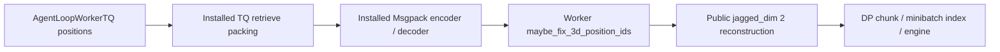

# R22 TQ mRoPE worker boundary repair

Root 已明确批准执行本修复。目标是修复 R22c 真实 `update_actor` 失败，保持位置值、模型、数据、奖励与 GRPO 参数不变。

固定 reference 与 273 uv 不修改；`prepare_runtime.py` 从不可变 reference 生成新 `/root/mimo-r22/runtime-torch211-v2-final`。仅在现有 worker 接收边界把收到的位置张量规范重建，不在训练入口猴子补丁 TQ。

文件：`examples/mimo_multidomain_rl/prepare_runtime.py`、`tests/uni_agent/examples/test_mimo_tensor_runtime.py`，以及本设计与同名 evidence/lesson。输入合同是每样本二维 `(position_axes, tokens)`，输出是 `(batch, position_axes, jagged_tokens)`；逐项位置值与输入 token 长度严格相同。实际 backing values 的维度、offsets 和 input_ids 各样本长度联合区分 axes-ragged 与 token-ragged，禁止只改私有 `_ragged_idx`。首轮真实测试发现 TensorDict consolidate/pickle 连公开 shape 的符号维也可能退化，不能只按 shape 判断；首轮 22 PASS/2 FAIL 原记录保留。

CPU A/B 调用真实生产 `list_of_dict_to_tensordict` 入队函数、已安装 `AsyncSimpleStorageManager._pack_field_values`、`KVStorageManager._merge_tensors_to_tensordict` 与 `MsgpackEncoder/Decoder`，覆盖同长四轴 8298、变长、三轴/一维控制、轴数等于长度的方阵、已有正确表示、重复边界调用、DP 与 minibatch index，以及 TensorDict consolidate/pickle。此门验证实际 retrieve 组装函数与线缆编码实现，不声称完整远程 ZMQ 网络或 GPU 更新通过。baseline 必须出现真实旧错误；fixed 必须保留全部 token/position 值，source/uv 指纹不变。完成后交 root review，GPU 重启由 root 独占。

最终云端 A/B：reference 15 FAIL / 9 PASS（51.38 秒），fixed 24/24 PASS（48.44 秒）。actual TQ 当前将 input_ids 组装为 jagged；若未来调用只给位置张量或给 dense input_ids，且 backing 矩阵方向仍存在歧义，则明确拒绝，不能猜测方向。空 minibatch 非本次 API 扩展范围；原 nested constructor 要求非空输入。本次未安装依赖、修改 uv/TQ 或启动 GPU；最终 GPU 更新仍由 root 独立验收。
